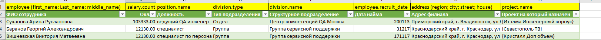
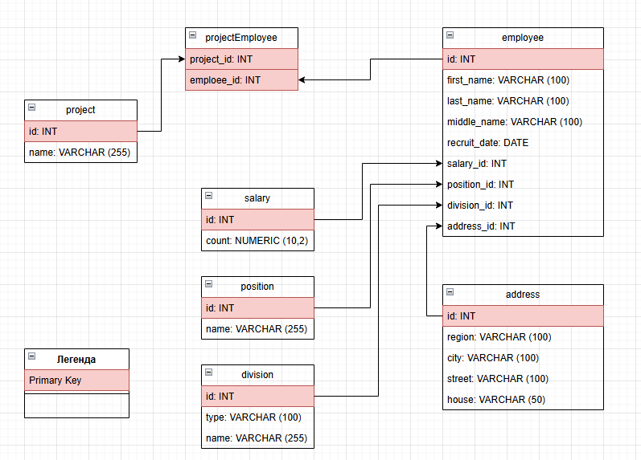
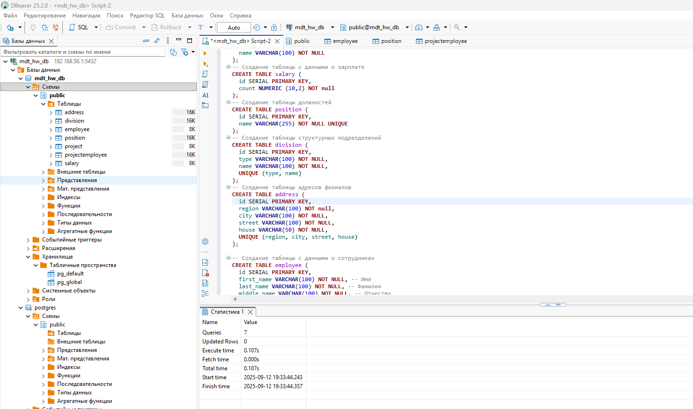

### Задание 1

Опишите не менее семи таблиц, из которых состоит база данных. Определите:

- какие данные хранятся в этих таблицах,
- какой тип данных у столбцов в этих таблицах, если данные хранятся в PostgreSQL.

Начертите схему полученной модели данных. Можете использовать онлайн-редактор: https://app.diagrams.net/

Этапы реализации:
1.	Внимательно изучите предоставленный вам файл с данными и подумайте, как можно сгруппировать данные по смыслу.
2.	Разбейте исходный файл на несколько таблиц и определите список столбцов в каждой из них. 
3.	Для каждого столбца подберите подходящий тип данных из PostgreSQL. 
4.	Для каждой таблицы определите первичный ключ (PRIMARY KEY).
5.	Определите типы связей между таблицами. 
6.	Начертите схему модели данных.
На схеме должны быть чётко отображены:
   - все таблицы с их названиями,
   - все столбцы  с указанием типов данных,
   - первичные ключи (они должны быть явно выделены),
   - линии, показывающие связи между таблицами.

**Результатом выполнения задания** должен стать скриншот получившейся схемы базы данных.




## Дополнительные задания (со звёздочкой*)
Эти задания дополнительные, то есть не обязательные к выполнению. Вы можете их выполнить, если хотите глубже и шире разобраться в материале.


### Задание 2*

1. Разверните СУБД Postgres на своей хостовой машине, на виртуальной машине или в контейнере docker.
2. Опишите схему, полученную в предыдущем задании, с помощью скрипта SQL.
3. Создайте в вашей полученной СУБД новую базу данных и выполните полученный ранее скрипт для создания вашей модели данных.

В качестве решения приложите SQL скрипт и скриншот диаграммы.

Для написания и редактирования sql удобно использовать  специальный инструмент dbeaver.

```
-- Создание таблицы со списком проектов
CREATE TABLE project (
  id SERIAL PRIMARY KEY,
  name VARCHAR(100) NOT NULL
);
-- Создание таблицы с данными о зарплате
CREATE TABLE salary (
  id SERIAL PRIMARY KEY,
  count NUMERIC (10,2) NOT null
);
-- Создание таблицы должностей
CREATE TABLE position (
  id SERIAL PRIMARY KEY,
  name VARCHAR(255) NOT NULL UNIQUE
);
-- Создание таблицы структурных подразделений
CREATE TABLE division (
  id SERIAL PRIMARY KEY,
  type VARCHAR(100) NOT NULL,
  name VARCHAR(100) NOT NULL,
  UNIQUE (type, name)
);
-- Создание таблицы адресов филиалов
CREATE TABLE address (
  id SERIAL PRIMARY KEY,
  region VARCHAR(100) NOT null,
  city VARCHAR(100) NOT NULL,
  street VARCHAR(100) NOT NULL,
  house VARCHAR(50) NOT NULL,
  UNIQUE (region, city, street, house)
);

-- Создание таблицы с данными о сотрудниках
CREATE TABLE employee (
  id SERIAL PRIMARY KEY,
  first_name VARCHAR(100) NOT NULL, -- Имя
  last_name VARCHAR(100) NOT NULL, -- Фамилия
  middle_name VARCHAR(100) NOT NULL, -- Отчество
  recruit_date DATE not null, -- Дата приема на работу
  salary_id INTEGER,
  position_id INTEGER,
  division_id INTEGER,
  address_id INTEGER,
  FOREIGN KEY (salary_id) REFERENCES salary(id),
  FOREIGN KEY (position_id) REFERENCES position(id),
  FOREIGN KEY (division_id) REFERENCES division(id),
  FOREIGN KEY (address_id) REFERENCES address(id)
);

-- Создание таблицы соответствия сотрудников и проектов (связь «многие ко многим» между project и employee), 
CREATE TABLE projectEmployee (
  id SERIAL PRIMARY KEY,
  project_id INTEGER NOT NULL,
  employee_id INTEGER NOT NULL,
  FOREIGN KEY (project_id) references project(id),
  FOREIGN KEY (employee_id) REFERENCES employee(id),
  UNIQUE (project_id, employee_id)
);

```



