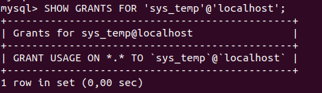
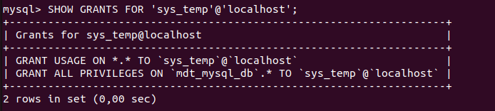
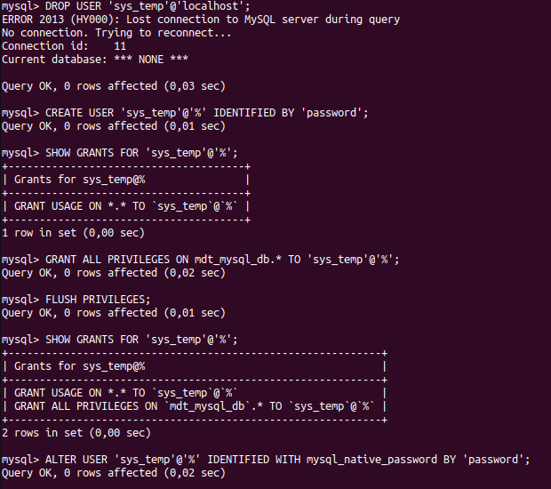
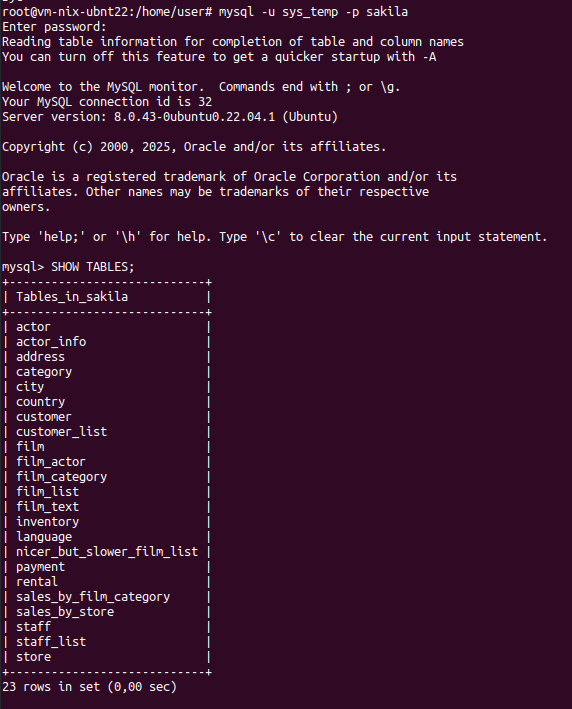
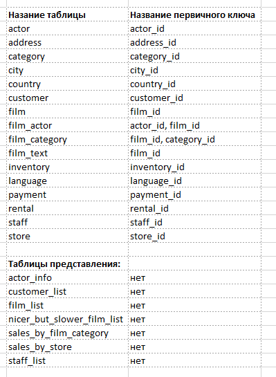
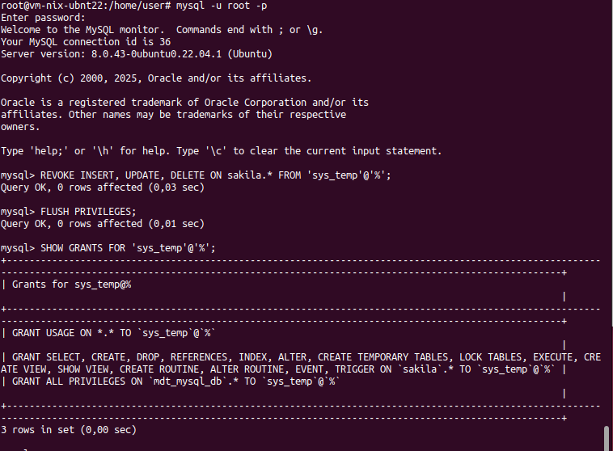

### Задание 1
1.1. Поднимите чистый инстанс MySQL версии 8.0+. Можно использовать локальный сервер или контейнер Docker.
1.2. Создайте учётную запись sys_temp. 
1.3. Выполните запрос на получение списка пользователей в базе данных. (скриншот)
1.4. Дайте все права для пользователя sys_temp. 
1.5. Выполните запрос на получение списка прав для пользователя sys_temp. (скриншот)
1.6. Переподключитесь к базе данных от имени sys_temp.
    Для смены типа аутентификации с sha2 используйте запрос: 
    ```sql
    ALTER USER 'sys_test'@'localhost' IDENTIFIED WITH mysql_native_password BY 'password';
    ```
1.6. По ссылке https://downloads.mysql.com/docs/sakila-db.zip скачайте дамп базы данных.
1.7. Восстановите дамп в базу данных.
1.8. При работе в IDE сформируйте ER-диаграмму получившейся базы данных. При работе в командной строке используйте команду для получения всех таблиц базы данных. (скриншот)
*Результатом работы должны быть скриншоты обозначенных заданий, а также простыня со всеми запросами.*

#### Решение
```
1.2
mysql> CREATE USER 'sys_temp'@'%' IDENTIFIED BY 'password';
mysql> CREATE DATABASE mdt_mysql_db;
1.3
mysql> SHOW GRANTS FOR 'sys_temp'@'%';
1.4
mysql> GRANT ALL PRIVILEGES ON mdt_mysql_db.* TO 'sys_temp'@'%';
mysql> FLUSH PRIVILEGES;
1.5
mysql> SHOW GRANTS FOR 'sys_temp'@'%';
1.6
mysql> ALTER USER 'sys_temp'@'%' IDENTIFIED WITH mysql_native_password BY 'password';
1.7
mysql -v -u root -p sakila < Downloads/sakila-db/sakila-schema.sql
mysql -v -u root -p sakila < Downloads/sakila-db/sakila-data.sql
```







### Задание 2
Составьте таблицу, используя любой текстовый редактор или Excel, в которой должно быть два столбца: в первом должны быть названия таблиц восстановленной базы, во втором названия первичных ключей этих таблиц. Пример: (скриншот/текст)
    ```
    Название таблицы | Название первичного ключа
    customer         | customer_id
    ```

#### Решение



### Задание 3*
3.1. Уберите у пользователя sys_temp права на внесение, изменение и удаление данных из базы sakila.
3.2. Выполните запрос на получение списка прав для пользователя sys_temp. (скриншот)
    *Результатом работы должны быть скриншоты обозначенных заданий, а также простыня со всеми запросами.*

#### Решение

```
mysql> REVOKE INSERT, UPDATE, DELETE ON sakila.* FROM 'sys_temp'@'%';
Query OK, 0 rows affected (0,03 sec)

mysql> FLUSH PRIVILEGES;
Query OK, 0 rows affected (0,01 sec)

```
