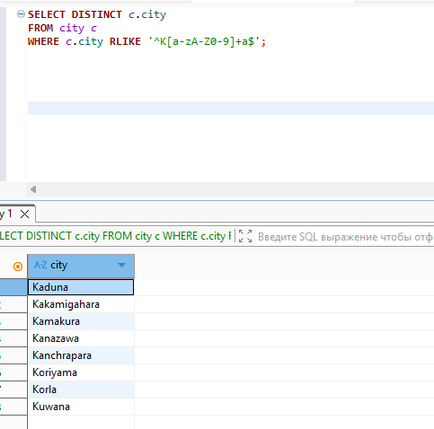

Задание можно выполнить как в любом IDE, так и в командной строке.

### Задание 1

Получите уникальные названия районов из таблицы с адресами, которые начинаются на “K” и заканчиваются на “a” и не содержат пробелов.

#### Решение
```
SELECT DISTINCT c.city
FROM city c
WHERE c.city RLIKE '^K[a-zA-Z0-9]+a$';
```


### Задание 2

Получите из таблицы платежей за прокат фильмов информацию по платежам, которые выполнялись в промежуток с 15 июня 2005 года по 18 июня 2005 года **включительно** и стоимость которых превышает 10.00.

#### Решение
```
SELECT p.payment_date, p.amount 
FROM payment p
WHERE (p.payment_date BETWEEN '2005-06-15' AND '2005-06-18') AND p.amount > '10.00';
```


### Задание 3

Получите последние пять аренд фильмов.

#### Решение
```
SELECT r.rental_date, r.return_date 
FROM rental r 
WHERE r.return_date IS NOT NULL
ORDER BY r.rental_date DESC
LIMIT 5;
```


### Задание 4

Одним запросом получите активных покупателей, имена которых Kelly или Willie. 

Сформируйте вывод в результат таким образом:
- все буквы в фамилии и имени из верхнего регистра переведите в нижний регистр,
- замените буквы 'll' в именах на 'pp'.

#### Решение
```
SELECT LOWER(REGEXP_REPLACE(c.first_name, 'll', 'pp')), c.last_name 
FROM customer c 
WHERE c.first_name IN ('Kelly', 'Willie');
```


### Задание 5*

Выведите Email каждого покупателя, разделив значение Email на две отдельных колонки: в первой колонке должно быть значение, указанное до @, во второй — значение, указанное после @.

#### Решение
```
SELECT
    SUBSTR(c.email, 1, POSITION('@' IN c.email) - 1) AS email_name,
    SUBSTR(c.email, POSITION('@' IN c.email) + 1) AS email_domain
FROM
    customer c;
```


### Задание 6*

Доработайте запрос из предыдущего задания, скорректируйте значения в новых колонках: первая буква должна быть заглавной, остальные — строчными.

#### Решение
```
SELECT 
CONCAT(UPPER(SUBSTRING(SUBSTR(c.email, 1, POSITION('@' IN c.email) - 1), 1, 1)), LOWER(SUBSTRING(SUBSTR(c.email, 1, POSITION('@' IN c.email) - 1), 2))) AS email_name,
CONCAT(UPPER(SUBSTRING(SUBSTR(c.email, POSITION('@' IN c.email) + 1), 1, 1)), LOWER(SUBSTRING(SUBSTR(c.email, POSITION('@' IN c.email) + 1), 2)))  AS email_domain
FROM 
customer c;
```
