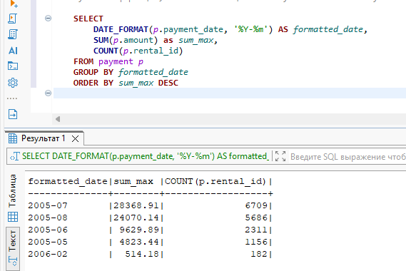
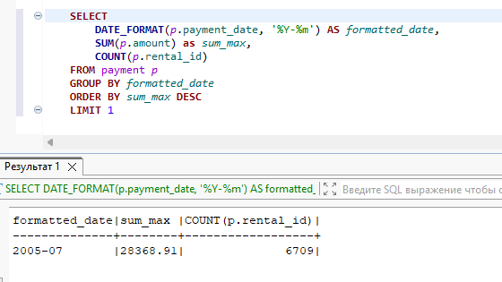

### Задание 1
Одним запросом получите информацию о магазине, в котором обслуживается более 300 покупателей, и выведите в результат следующую информацию: 
- фамилия и имя сотрудника из этого магазина;
- город нахождения магазина;
- количество пользователей, закреплённых в этом магазине.

#### Решение
```
    SELECT st.first_name, st.last_name, c.city, COUNT(cu.customer_id)
    FROM store s
    LEFT JOIN address a ON s.address_id = a.address_id
    LEFT JOIN city c ON a.city_id  = c.city_id 
    LEFT JOIN staff st ON s.manager_staff_id = st.staff_id 
    LEFT JOIN customer cu ON s.store_id = cu.store_id
    GROUP BY s.manager_staff_id
    HAVING COUNT(cu.customer_id ) >300;
```


### Задание 2
Получите количество фильмов, продолжительность которых больше средней продолжительности всех фильмов.

#### Решение
```
    SELECT COUNT(*)
    FROM film f
    WHERE f.`length` >= (SELECT AVG(`length`) FROM film);
```


### Задание 3
Получите информацию, за какой месяц была получена наибольшая сумма платежей, и добавьте информацию по количеству аренд за этот месяц.



```
# Вариант 1
    SELECT
 		DATE_FORMAT(p.payment_date, '%Y-%m') AS formatted_date,
        SUM(p.amount) as sum_max,
        COUNT(p.rental_id)
    FROM payment p
    GROUP BY formatted_date
    ORDER BY sum_max DESC
	LIMIT 1
```



```
# Вариант 2 (но мы временных таблиц еще не проходили)
    WITH MonthlyTotals AS (
        SELECT
            DATE_FORMAT(p.payment_date, '%Y-%m') AS month_number,
            SUM(p.amount) AS total_amount,
            COUNT(p.rental_id) AS rental_count
        FROM payment p
        GROUP BY month_number
    )
    SELECT *
    FROM MonthlyTotals mt
    WHERE mt.total_amount = (SELECT MAX(mt.total_amount) FROM MonthlyTotals mt);
```


### Задание 4*
Посчитайте количество продаж, выполненных каждым продавцом. Добавьте вычисляемую колонку «Премия». Если количество продаж превышает 8000, то значение в колонке будет «Да», иначе должно быть значение «Нет».

```
    SELECT
        p.staff_id,
        COUNT(p.amount),
        CASE
            WHEN COUNT(p.amount) > 8000 THEN 'YES'
            ELSE 'NO'
        END AS bonus
    FROM payment p 
    GROUP BY p.staff_id
    ;
```


### Задание 5*
Найдите фильмы, которые ни разу не брали в аренду.

```
    SELECT
        f.film_id,
        f.title
    FROM film f
    LEFT JOIN inventory i ON f.film_id = i.film_id
    LEFT JOIN rental r  ON i.inventory_id = r.inventory_id
    WHERE r.rental_date IS NULL
    ;
```

