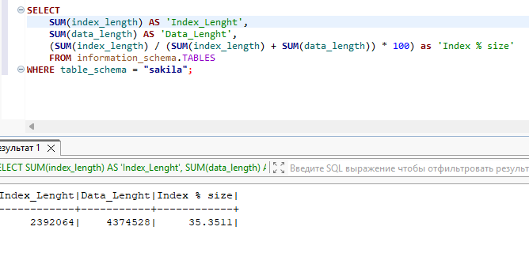
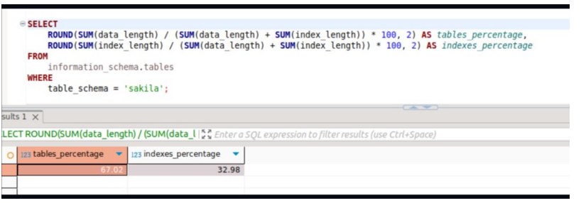
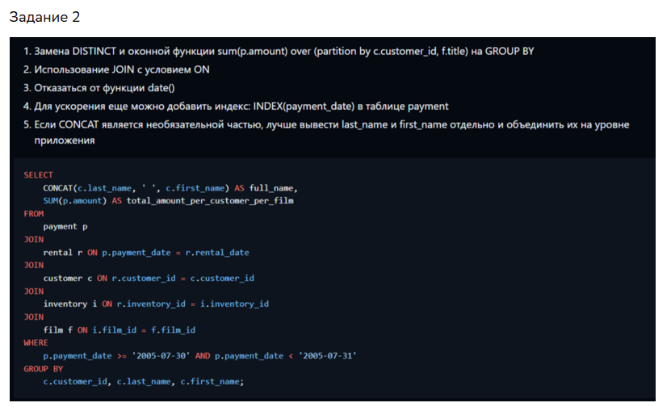
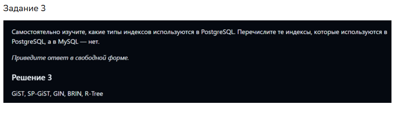

### Задание 1

Напишите запрос к учебной базе данных, который вернёт процентное отношение общего размера всех индексов к общему размеру всех таблиц.

#### Решение
```
SELECT (SUM(index_length) / (SUM(index_length) + SUM(data_length)) * 100) as index_size
FROM information_schema.TABLES
WHERE table_schema = "sakila";
```


### Задание 2

Выполните explain analyze следующего запроса:
```sql
select distinct concat(c.last_name, ' ', c.first_name), sum(p.amount) over (partition by c.customer_id, f.title)
from payment p, rental r, customer c, inventory i, film f
where date(p.payment_date) = '2005-07-30' and p.payment_date = r.rental_date and r.customer_id = c.customer_id and i.inventory_id = r.inventory_id
```
- перечислите узкие места;
- оптимизируйте запрос: внесите корректировки по использованию операторов, при необходимости добавьте индексы.

#### Решение

```
Вывод команды:

EXPLAIN ANALYZE
SELECT DISTINCT 
	CONCAT(c.last_name, ' ', c.first_name), 
	SUM(p.amount) OVER (PARTITION BY c.customer_id, f.title)
FROM 
	payment p, 
	rental r, 
	customer c, 
	inventory i, 
	film f
WHERE 
	DATE(p.payment_date) = '2005-07-30' AND 
	p.payment_date = r.rental_date AND 
	r.customer_id = c.customer_id AND 
	i.inventory_id = r.inventory_id
;

-> Table scan on <temporary>  (cost=2.5..2.5 rows=0) (actual time=3403..3403 rows=391 loops=1)
    -> Temporary table with deduplication  (cost=0..0 rows=0) (actual time=3403..3403 rows=391 loops=1)
        -> Window aggregate with buffering: sum(payment.amount) OVER (PARTITION BY c.customer_id,f.title )   (actual time=1534..3298 rows=642000 loops=1)
            -> Sort: c.customer_id, f.title  (actual time=1534..1574 rows=642000 loops=1)
                -> Stream results  (cost=10e+6 rows=15.4e+6) (actual time=0.595..1128 rows=642000 loops=1)
                    -> Nested loop inner join  (cost=10e+6 rows=15.4e+6) (actual time=0.59..973 rows=642000 loops=1)
                        -> Nested loop inner join  (cost=8.47e+6 rows=15.4e+6) (actual time=0.586..837 rows=642000 loops=1)
                            -> Nested loop inner join  (cost=6.93e+6 rows=15.4e+6) (actual time=0.581..699 rows=642000 loops=1)
                                -> Inner hash join (no condition)  (cost=1.54e+6 rows=15.4e+6) (actual time=0.57..32 rows=634000 loops=1)
                                    -> Filter: (cast(p.payment_date as date) = '2005-07-30')  (cost=1.61 rows=15400) (actual time=0.118..4.19 rows=634 loops=1)
                                        -> Table scan on p  (cost=1.61 rows=15400) (actual time=0.11..2.75 rows=16044 loops=1)
                                    -> Hash
                                        -> Covering index scan on f using idx_title  (cost=103 rows=1000) (actual time=0.0261..0.404 rows=1000 loops=1)
                                -> Covering index lookup on r using rental_date (rental_date=p.payment_date)  (cost=0.25 rows=1) (actual time=655e-6..939e-6 rows=1.01 loops=634000)
                            -> Single-row index lookup on c using PRIMARY (customer_id=r.customer_id)  (cost=250e-6 rows=1) (actual time=88.2e-6..108e-6 rows=1 loops=642000)
                        -> Single-row covering index lookup on i using PRIMARY (inventory_id=r.inventory_id)  (cost=250e-6 rows=1) (actual time=84e-6..104e-6 rows=1 loops=642000)
```

Анализ:

```
1) Не используется индекс в p.paymant_date:
    -> Filter: (cast(p.payment_date as date) = '2005-07-30')  (cost=1.61 rows=15400) (actual time=0.118..4.19 rows=634 loops=1)
        -> Table scan on p  (cost=1.61 rows=15400) (actual time=0.11..2.75 rows=16044 loops=1)
2) Декартово произведение film (rows=1000) и результата фильтра по p.payment_date (rows=634):
    -> Inner hash join (no condition)  (cost=1.54e+6 rows=15.4e+6) (actual time=0.57..32 rows=634000 loops=1)
        -> Filter: (cast(p.payment_date as date) = '2005-07-30')  (cost=1.61 rows=15400) (actual time=0.118..4.19 rows=634 loops=1)
            -> Table scan on p  (cost=1.61 rows=15400) (actual time=0.11..2.75 rows=16044 loops=1)
        -> Hash
            -> Covering index scan on f using idx_title  (cost=103 rows=1000) (actual time=0.0261..0.404 rows=1000 loops=1)
    При этом т.к. мы показываем общую сумму по каждому клиенту, то ниспользование f.title избыточно, т.к. клиент мог арендовать фильм много раз.
3) Далее все операции идут относительно 642000 строк:
    -> Window aggregate with buffering: sum(payment.amount) OVER (PARTITION BY c.customer_id,f.title )   (actual time=1534..3298 rows=642000 loops=1)
        -> Sort: c.customer_id, f.title  (actual time=1534..1574 rows=642000 loops=1)
            -> Stream results  (cost=10e+6 rows=15.4e+6) (actual time=0.595..1128 rows=642000 loops=1)
                -> Nested loop inner join  (cost=10e+6 rows=15.4e+6) (actual time=0.59..973 rows=642000 loops=1)
                    -> Nested loop inner join  (cost=8.47e+6 rows=15.4e+6) (actual time=0.586..837 rows=642000 loops=1)
                        -> Nested loop inner join  (cost=6.93e+6 rows=15.4e+6) (actual time=0.581..699 rows=642000 loops=1)
4) Использование WHERE, когда можно объединить через INNER JOIN
5) Избыточные соединения 

```
Решение:
```
EXPLAIN ANALYZE
SELECT DISTINCT 
    CONCAT(c.last_name, ' ', c.first_name), 
    SUM(p.amount) OVER (PARTITION BY c.customer_id)
FROM 
    payment p
    INNER JOIN rental r ON p.payment_date = r.rental_date
    INNER JOIN customer c ON r.customer_id = c.customer_id
WHERE 
    p.payment_date >= '2005-07-30' AND p.payment_date < '2005-07-31'
    ;

-> Table scan on <temporary>  (cost=2.5..2.5 rows=0) (actual time=8.73..8.76 rows=391 loops=1)
    -> Temporary table with deduplication  (cost=0..0 rows=0) (actual time=8.73..8.73 rows=391 loops=1)
        -> Window aggregate with buffering: sum(payment.amount) OVER (PARTITION BY c.customer_id )   (actual time=8.11..8.62 rows=642 loops=1)
            -> Sort: c.customer_id  (actual time=8.09..8.11 rows=642 loops=1)
                -> Stream results  (cost=3991 rows=1711) (actual time=0.228..7.95 rows=642 loops=1)
                    -> Nested loop inner join  (cost=3991 rows=1711) (actual time=0.224..7.7 rows=642 loops=1)
                        -> Nested loop inner join  (cost=3393 rows=1711) (actual time=0.217..7.13 rows=642 loops=1)
                            -> Filter: ((p.payment_date >= TIMESTAMP'2005-07-30 00:00:00') and (p.payment_date < TIMESTAMP'2005-07-31 00:00:00'))  (cost=1564 rows=1711) (actual time=0.208..5.39 rows=634 loops=1)
                                -> Table scan on p  (cost=1564 rows=15400) (actual time=0.2..3.43 rows=16044 loops=1)
                            -> Covering index lookup on r using rental_date (rental_date=p.payment_date)  (cost=0.969 rows=1) (actual time=0.00162..0.00234 rows=1.01 loops=634)
                        -> Single-row index lookup on c using PRIMARY (customer_id=r.customer_id)  (cost=0.25 rows=1) (actual time=718e-6..739e-6 rows=1 loops=642)


```

## Дополнительные задания (со звёздочкой*)
Эти задания дополнительные, то есть не обязательные к выполнению, и никак не повлияют на получение вами зачёта по этому домашнему заданию. Вы можете их выполнить, если хотите глубже шире разобраться в материале.

### Задание 3*

Самостоятельно изучите, какие типы индексов используются в PostgreSQL. Перечислите те индексы, которые используются в PostgreSQL, а в MySQL — нет.

#### Решение
- BRIN (Block Range Index)	
- SP-GiST (Space Partitioned GiST)	
- GIN (Generalized Inverted Index)	
- Parallel index creation
- Individually customizable operator classes
- More advanced partial indexing


ЭТАЛОННОЕ РЕШЕНИЕ





