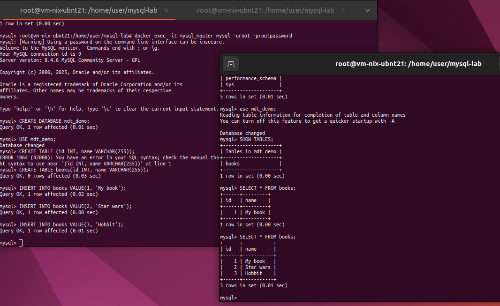
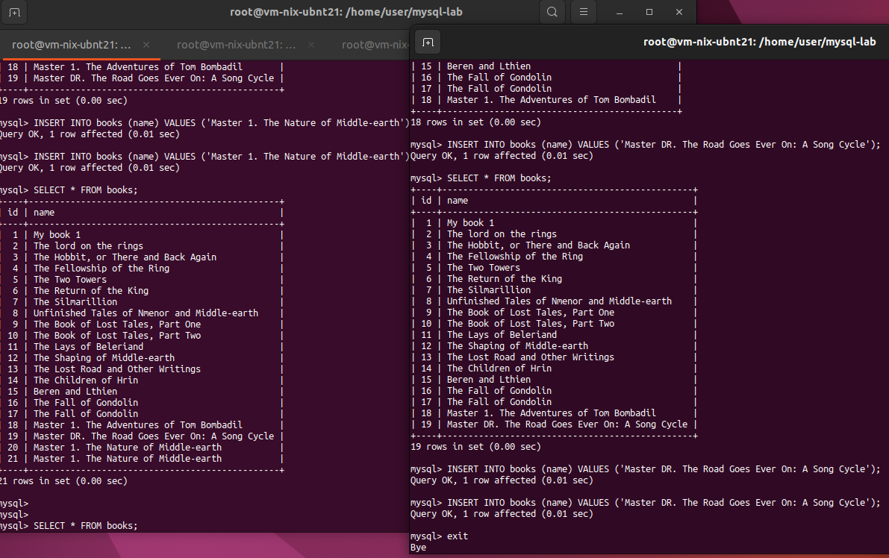

### Задание 1

На лекции рассматривались режимы репликации master-slave, master-master, опишите их различия.

*Ответить в свободной форме.*

#### Решение 1

master-slave
Данные пишутся, изменяются в master - читаются из slave
Нет издержек на обработку блокировок, в случае падения master переключение пройдет после того, как slave убедится что он главный.
Наиболее часто испльзуемая конфигурация

master-master
Данные пишутся, изменяются в обеих базах, синхронизируются, читаются с обеих баз (как M-S , но в обе стороны).
Быстрее переключение в случае падения master (мгновенно), но дополнительные издержки на обработку блокировок 

---

### Задание 2

Выполните конфигурацию master-slave репликации, примером можно пользоваться из лекции.

*Приложите скриншоты конфигурации, выполнения работы: состояния и режимы работы серверов.*

#### Решение 2
```
Команды при настройке в файле Temp_EX2.sh

mysql> SHOW REPLICA STATUS\G;
*************************** 1. row ***************************
             Replica_IO_State: Waiting for source to send event
                  Source_Host: mysql_master
                  Source_User: replica
                  Source_Port: 3306
                Connect_Retry: 60
              Source_Log_File: 74dca74a297c-bin.000001
          Read_Source_Log_Pos: 1477
               Relay_Log_File: 5e61f2c37df5-relay-bin.000004
                Relay_Log_Pos: 1708
        Relay_Source_Log_File: 74dca74a297c-bin.000001
           Replica_IO_Running: Yes
          Replica_SQL_Running: Yes
              Replicate_Do_DB: 
          Replicate_Ignore_DB: 
           Replicate_Do_Table: 
       Replicate_Ignore_Table: 
      Replicate_Wild_Do_Table: 
  Replicate_Wild_Ignore_Table: 
                   Last_Errno: 0
                   Last_Error: 
                 Skip_Counter: 0
          Exec_Source_Log_Pos: 1477
              Relay_Log_Space: 2107
              Until_Condition: None
               Until_Log_File: 
                Until_Log_Pos: 0
           Source_SSL_Allowed: No
           Source_SSL_CA_File: 
           Source_SSL_CA_Path: 
              Source_SSL_Cert: 
            Source_SSL_Cipher: 
               Source_SSL_Key: 
        Seconds_Behind_Source: 0
Source_SSL_Verify_Server_Cert: No
                Last_IO_Errno: 0
                Last_IO_Error: 
               Last_SQL_Errno: 0
               Last_SQL_Error: 
  Replicate_Ignore_Server_Ids: 
             Source_Server_Id: 1
                  Source_UUID: 60607324-9f88-11f0-8c6c-0242ac110002
             Source_Info_File: mysql.slave_master_info
                    SQL_Delay: 0
          SQL_Remaining_Delay: NULL
    Replica_SQL_Running_State: Replica has read all relay log; waiting for more updates
           Source_Retry_Count: 10
                  Source_Bind: 
      Last_IO_Error_Timestamp: 
     Last_SQL_Error_Timestamp: 
               Source_SSL_Crl: 
           Source_SSL_Crlpath: 
           Retrieved_Gtid_Set: 
            Executed_Gtid_Set: 
                Auto_Position: 0
         Replicate_Rewrite_DB: 
                 Channel_Name: 
           Source_TLS_Version: 
       Source_public_key_path: 
        Get_Source_public_key: 0
            Network_Namespace: 
1 row in set (0.00 sec)

ERROR: 
No query specified


```


---

### Задание 3* 

Выполните конфигурацию master-master репликации. Произведите проверку.

*Приложите скриншоты конфигурации, выполнения работы: состояния и режимы работы серверов.*

#### Решение 3
```
Команды при настройке в файле Temp_EX3.sh

mysql> SHOW REPLICA STATUS\G;
*************************** 1. row ***************************
             Replica_IO_State: Waiting for source to send event
                  Source_Host: mysql_master_dr
                  Source_User: mdt_replica_2
                  Source_Port: 3306
                Connect_Retry: 60
              Source_Log_File: 7f4a01a22557-bin.000002
          Read_Source_Log_Pos: 12141
               Relay_Log_File: 74dca74a297c-relay-bin.000004
                Relay_Log_Pos: 1409
        Relay_Source_Log_File: 7f4a01a22557-bin.000002
           Replica_IO_Running: Yes
          Replica_SQL_Running: Yes
              Replicate_Do_DB: 
          Replicate_Ignore_DB: 
           Replicate_Do_Table: 
       Replicate_Ignore_Table: 
      Replicate_Wild_Do_Table: 
  Replicate_Wild_Ignore_Table: 
                   Last_Errno: 0
                   Last_Error: 
                 Skip_Counter: 0
          Exec_Source_Log_Pos: 12141
              Relay_Log_Space: 2409
              Until_Condition: None
               Until_Log_File: 
                Until_Log_Pos: 0
           Source_SSL_Allowed: Yes
           Source_SSL_CA_File: 
           Source_SSL_CA_Path: 
              Source_SSL_Cert: 
            Source_SSL_Cipher: 
               Source_SSL_Key: 
        Seconds_Behind_Source: 0
Source_SSL_Verify_Server_Cert: No
                Last_IO_Errno: 0
                Last_IO_Error: 
               Last_SQL_Errno: 0
               Last_SQL_Error: 
  Replicate_Ignore_Server_Ids: 
             Source_Server_Id: 3
                  Source_UUID: 1c86cdf8-9f9f-11f0-9d31-0242ac110004
             Source_Info_File: mysql.slave_master_info
                    SQL_Delay: 0
          SQL_Remaining_Delay: NULL
    Replica_SQL_Running_State: Replica has read all relay log; waiting for more updates
           Source_Retry_Count: 10
                  Source_Bind: 
      Last_IO_Error_Timestamp: 
     Last_SQL_Error_Timestamp: 
               Source_SSL_Crl: 
           Source_SSL_Crlpath: 
           Retrieved_Gtid_Set: 
            Executed_Gtid_Set: 
                Auto_Position: 0
         Replicate_Rewrite_DB: 
                 Channel_Name: 
           Source_TLS_Version: 
       Source_public_key_path: 
        Get_Source_public_key: 0
            Network_Namespace: 
1 row in set (0.00 sec)

ERROR: 
No query specified


mysql> SHOW REPLICA STATUS\G;
*************************** 1. row ***************************
             Replica_IO_State: Waiting for source to send event
                  Source_Host: mysql_master
                  Source_User: mdt_replica_1
                  Source_Port: 3306
                Connect_Retry: 60
              Source_Log_File: 74dca74a297c-bin.000003
          Read_Source_Log_Pos: 3057
               Relay_Log_File: 7f4a01a22557-relay-bin.000006
                Relay_Log_Pos: 1697
        Relay_Source_Log_File: 74dca74a297c-bin.000003
           Replica_IO_Running: Yes
          Replica_SQL_Running: Yes
              Replicate_Do_DB: 
          Replicate_Ignore_DB: 
           Replicate_Do_Table: 
       Replicate_Ignore_Table: 
      Replicate_Wild_Do_Table: 
  Replicate_Wild_Ignore_Table: 
                   Last_Errno: 0
                   Last_Error: 
                 Skip_Counter: 0
          Exec_Source_Log_Pos: 3057
              Relay_Log_Space: 2092
              Until_Condition: None
               Until_Log_File: 
                Until_Log_Pos: 0
           Source_SSL_Allowed: Yes
           Source_SSL_CA_File: 
           Source_SSL_CA_Path: 
              Source_SSL_Cert: 
            Source_SSL_Cipher: 
               Source_SSL_Key: 
        Seconds_Behind_Source: 0
Source_SSL_Verify_Server_Cert: No
                Last_IO_Errno: 0
                Last_IO_Error: 
               Last_SQL_Errno: 0
               Last_SQL_Error: 
  Replicate_Ignore_Server_Ids: 
             Source_Server_Id: 1
                  Source_UUID: 60607324-9f88-11f0-8c6c-0242ac110002
             Source_Info_File: mysql.slave_master_info
                    SQL_Delay: 0
          SQL_Remaining_Delay: NULL
    Replica_SQL_Running_State: Replica has read all relay log; waiting for more updates
           Source_Retry_Count: 10
                  Source_Bind: 
      Last_IO_Error_Timestamp: 
     Last_SQL_Error_Timestamp: 
               Source_SSL_Crl: 
           Source_SSL_Crlpath: 
           Retrieved_Gtid_Set: 
            Executed_Gtid_Set: 
                Auto_Position: 0
         Replicate_Rewrite_DB: 
                 Channel_Name: 
           Source_TLS_Version: 
       Source_public_key_path: 
        Get_Source_public_key: 0
            Network_Namespace: 
1 row in set (0.00 sec)

ERROR: 
No query specified


```


