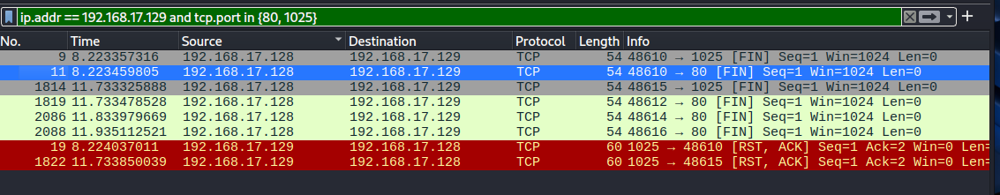

### Задание 1

Скачайте и установите виртуальную машину Metasploitable: https://sourceforge.net/projects/metasploitable/.
Это типовая ОС для экспериментов в области информационной безопасности, с которой следует начать при анализе уязвимостей.
Просканируйте эту виртуальную машину, используя **nmap**.
Попробуйте найти уязвимости, которым подвержена эта виртуальная машина.
Сами уязвимости можно поискать на сайте https://www.exploit-db.com/.
Для этого нужно в поиске ввести название сетевой службы, обнаруженной на атакуемой машине, и выбрать подходящие по версии уязвимости.

Ответьте на следующие вопросы:

- Какие сетевые службы в ней разрешены?
- Какие уязвимости были вами обнаружены? (список со ссылками: достаточно трёх уязвимостей)
  
*Приведите ответ в свободной форме.*  
#### Решение 1

```
nmap -A 192.168.1.36

1099/tcp open  java-rmi    GNU Classpath grmiregistry

msfconsole
use exploit/multi/misc/java_rmi_server
set RHOST 192.168.1.36
exploit

msf > searchsploit bind 9.4.2
[*] exec: searchsploit bind 9.4.2

------------------------------------------------------------------------ ---------------------------------
 Exploit Title                                                          |  Path
------------------------------------------------------------------------ ---------------------------------
BIND 9.4.1 < 9.4.2 - Remote DNS Cache Poisoning (Metasploit)            | multiple/remote/6122.rb
------------------------------------------------------------------------ ---------------------------------
Shellcodes: No Results


sf > searchsploitapache 2.2.8
[-] Unknown command: searchsploitapache. Run the help command for more details.
msf > searchsploit apache 2.2.8
[*] exec: searchsploit apache 2.2.8

------------------------------------------------------------------------ ---------------------------------
 Exploit Title                                                          |  Path
------------------------------------------------------------------------ ---------------------------------
Apache + PHP < 5.3.12 / < 5.4.2 - cgi-bin Remote Code Execution         | php/remote/29290.c
Apache + PHP < 5.3.12 / < 5.4.2 - Remote Code Execution + Scanner       | php/remote/29316.py
Apache < 2.0.64 / < 2.2.21 mod_setenvif - Integer Overflow              | linux/dos/41769.txt
Apache < 2.2.34 / < 2.4.27 - OPTIONS Memory Leak                        | linux/webapps/42745.py
Apache CXF < 2.5.10/2.6.7/2.7.4 - Denial of Service                     | multiple/dos/26710.txt
Apache mod_ssl < 2.8.7 OpenSSL - 'OpenFuck.c' Remote Buffer Overflow    | unix/remote/21671.c
Apache mod_ssl < 2.8.7 OpenSSL - 'OpenFuckV2.c' Remote Buffer Overflow  | unix/remote/47080.c
Apache mod_ssl < 2.8.7 OpenSSL - 'OpenFuckV2.c' Remote Buffer Overflow  | unix/remote/764.c
Apache OpenMeetings 1.9.x < 3.1.0 - '.ZIP' File Directory Traversal     | linux/webapps/39642.txt
Apache Struts 2 < 2.3.1 - Multiple Vulnerabilities                      | multiple/webapps/18329.txt
Apache Struts 2.0.1 < 2.3.33 / 2.5 < 2.5.10 - Arbitrary Code Execution  | multiple/remote/44556.py
Apache Struts < 1.3.10 / < 2.3.16.2 - ClassLoader Manipulation Remote C | multiple/remote/41690.rb
Apache Struts2 2.0.0 < 2.3.15 - Prefixed Parameters OGNL Injection      | multiple/webapps/44583.txt
Apache Tomcat < 5.5.17 - Remote Directory Listing                       | multiple/remote/2061.txt
Apache Tomcat < 6.0.18 - 'utf8' Directory Traversal                     | unix/remote/14489.c
Apache Tomcat < 6.0.18 - 'utf8' Directory Traversal (PoC)               | multiple/remote/6229.txt
Apache Tomcat < 9.0.1 (Beta) / < 8.5.23 / < 8.0.47 / < 7.0.8 - JSP Uplo | jsp/webapps/42966.py
Apache Tomcat < 9.0.1 (Beta) / < 8.5.23 / < 8.0.47 / < 7.0.8 - JSP Uplo | windows/webapps/42953.txt
Apache Xerces-C XML Parser < 3.1.2 - Denial of Service (PoC)            | linux/dos/36906.txt
Webfroot Shoutbox < 2.32 (Apache) - Local File Inclusion / Remote Code  | linux/remote/34.pl
------------------------------------------------------------------------ ---------------------------------
Shellcodes: No Results

sf > searchsploit mysql 5.0
[*] exec: searchsploit mysql 5.0

------------------------------------------------------------------------ ---------------------------------
 Exploit Title                                                          |  Path
------------------------------------------------------------------------ ---------------------------------
MySQL 4.1.18/5.0.20 - Local/Remote Information Leakage                  | linux/remote/1742.c
MySQL 4.1/5.0 - Authentication Bypass                                   | multiple/remote/24250.pl
MySQL 4.1/5.0 - Zero-Length Password Authentication Bypass              | multiple/remote/311.pl
MySQL 4.x/5.0 (Linux) - User-Defined Function (UDF) Dynamic Library (2) | linux/local/1518.c
MySQL 4.x/5.0 (Windows) - User-Defined Function Command Execution       | windows/remote/3274.txt
MySQL 5.0.18 - Query Logging Bypass                                     | linux/remote/27326.txt
MySQL 5.0.20 - COM_TABLE_DUMP Memory Leak/Remote Buffer Overflow        | linux/remote/1741.c
MySQL 5.0.45 - 'Alter' Denial of Service                                | multiple/dos/4615.txt
MySQL 5.0.45 - (Authenticated) COM_CREATE_DB Format String (PoC)        | multiple/dos/9085.txt
MySQL 5.0.75 - 'sql_parse.cc' Multiple Format String Vulnerabilities    | linux/dos/33077.c
MySQL 5.0.x - IF Query Handling Remote Denial of Service                | linux/dos/30020.txt
MySQL 5.0.x - Single Row SubSelect Remote Denial of Service             | linux/dos/29724.txt
MySQL < 5.6.35 / < 5.7.17 - Integer Overflow                            | multiple/dos/41954.py
MySQL < 5.6.35 / < 5.7.17 - Integer Overflow                            | multiple/dos/41954.py
MySQL MaxDB Webtool 7.5.00.23 - Remote Stack Overflow                   | windows/remote/960.c
Oracle MySQL < 5.1.49 - 'DDL' Statements Denial of Service              | linux/dos/34522.txt
Oracle MySQL < 5.1.49 - 'WITH ROLLUP' Denial of Service                 | multiple/dos/15467.txt
Oracle MySQL < 5.1.49 - Malformed 'BINLOG' Arguments Denial of Service  | linux/dos/34521.txt
Oracle MySQL < 5.1.50 - Privilege Escalation                            | multiple/remote/34796.txt
Symantec Web Gateway 5.0.3.18 - Blind SQL Injection Backdoor via MySQL  | php/webapps/20044.txt
------------------------------------------------------------------------ ---------------------------------
Shellcodes: No Results

```


### Задание 2

Проведите сканирование Metasploitable в режимах SYN, FIN, Xmas, UDP.
Запишите сеансы сканирования в Wireshark.

Ответьте на следующие вопросы:

- Чем отличаются эти режимы сканирования с точки зрения сетевого трафика?
- Как отвечает сервер?

*Приведите ответ в свободной форме.*

#### Решение 2

'''
SYN / nmap -sS 192.168.17.129

На сервер отправляется TCP SYN пакет
    9	0.088487543	192.168.17.128	192.168.17.129	TCP	58	40749 → 80 [SYN] Seq=0 Win=1024 Len=0 MSS=1460
Если порт открыт, сервер отправляет SYN-ACK ответ
    19	0.089008908	192.168.17.129	192.168.17.128	TCP	60	80 → 40749 [SYN, ACK] Seq=0 Ack=1 Win=5840 Len=0 MSS=1460
Далее клиент закрывает сессию, отправляет RST пакет
    23	0.089040412	192.168.17.128	192.168.17.129	TCP	54	40749 → 80 [RST] Seq=1 Win=0 Len=0

Если порт закрыт, то сервер отвечает RST-ACK пакетом:
    58	0.089756896	192.168.17.129	192.168.17.128	TCP	60	256 → 40749 [RST, ACK] Seq=1 Ack=1 Win=0 Len=0

FIN / nmap -sF 192.168.1.36
Клиент отправляет FIN пакет на сервер
    9	8.223357316	192.168.17.128	192.168.17.129	TCP	54	48610 → 1025 [FIN] Seq=1 Win=1024 Len=0
    11	8.223459805	192.168.17.128	192.168.17.129	TCP	54	48610 → 80 [FIN] Seq=1 Win=1024 Len=0
Если порт открыт, то 
    ответа нет
Если порт закрыт, то в ответ получаем RST, ACK пакет:
    19	8.224037011	192.168.17.129	192.168.17.128	TCP	60	1025 → 48610 [RST, ACK] Seq=1 Ack=2 Win=0 Len=0

Xmas / nmap -sX 192.168.1.36
Клиент отправляет пакет с FIN, PSH, URG флагами
    2036	11.340096024	192.168.17.128	192.168.17.129	TCP	54	59128 → 80 [FIN, PSH, URG] Seq=1 Win=1024 Urg=0 Len=0
    2038	11.340112665	192.168.17.128	192.168.17.129	TCP	54	59128 → 1025 [FIN, PSH, URG] Seq=1 Win=1024 Urg=0 Len=0
Если порт открыт
    ответа нет
Если порт закрыт, то в ответ приходит пакет с RST, ACK флагами
    2043	11.340409836	192.168.17.129	192.168.17.128	TCP	60	1025 → 59128 [RST, ACK] Seq=1 Ack=2 Win=0 Len=0

UDP / nmap -sU 192.168.1.36 -p 50-150
Клиент отправляет на сервер UDP пакет
    5	0.140074345	192.168.17.128	192.168.17.129	UDP	82	63356 → 35794 Len=40
Если порт открыт, то приходит udp ответ
    539	172.098615908	192.168.17.129	192.168.17.255	BROWSER	285	Local Master Announcement VM-NIX-META01, Workstation, Server, Print Queue Server, Xenix Server, NT Workstation, NT Server, Master Browser
        User Datagram Protocol, Src Port: 138, Dst Port: 138
    540	172.098615925	192.168.17.129	192.168.17.255	BROWSER	256	Domain/Workgroup Announcement WORKGROUP, NT Workstation, Domain Enum
        User Datagram Protocol, Src Port: 138, Dst Port: 138
Если порт закрыт, то ICMP пакет с инфо о недоступности порта
    15	0.140475655	192.168.17.129	192.168.17.128	ICMP	110	Destination unreachable (Port unreachable)
       User Datagram Protocol, Src Port: 63356, Dst Port: 35794

UDP сканирование самое долгое.
'''




