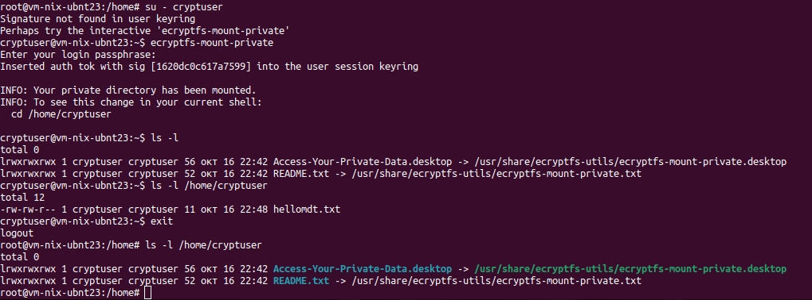
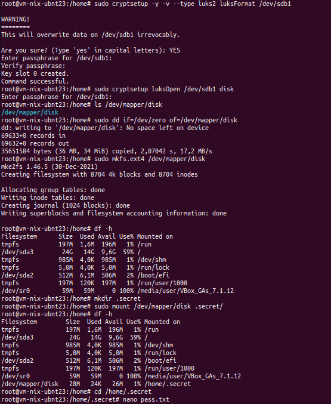
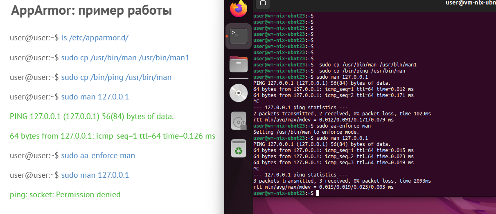

### Задание 1
1. Установите **eCryptfs**.
2. Добавьте пользователя cryptouser.
3. Зашифруйте домашний каталог пользователя с помощью eCryptfs.
*В качестве ответа  пришлите снимки экрана домашнего каталога пользователя с исходными и зашифрованными данными.*  

#### Решение 1


### Задание 2
1. Установите поддержку **LUKS**.
2. Создайте небольшой раздел, например, 100 Мб.
3. Зашифруйте созданный раздел с помощью LUKS.
*В качестве ответа пришлите снимки экрана с поэтапным выполнением задания.*

#### Решение 2



### Задание 3 *
1. Установите **apparmor**.
2. Повторите эксперимент, указанный в лекции.
3. Отключите (удалите) apparmor.
*В качестве ответа пришлите снимки экрана с поэтапным выполнением задания.*

#### Решение 3
```
как-то так...
```


```
ser@vm-nix-ubnt23:~$ sudo apt remove --purge apparmor
Reading package lists... Done
Building dependency tree... Done
...
Purging configuration files for firefox (1:1snap1-0ubuntu2) ...
Purging configuration files for apparmor (3.0.4-2ubuntu2.4) ...
Purging configuration files for apparmor-utils (3.0.4-2ubuntu2.4) ...
user@vm-nix-ubnt23:~$ sudo apparmor_status
sudo: apparmor_status: command not found

```