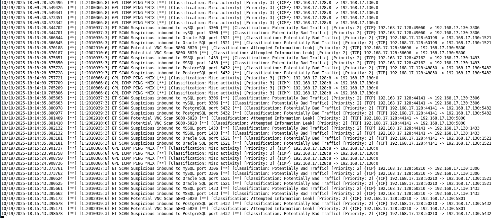
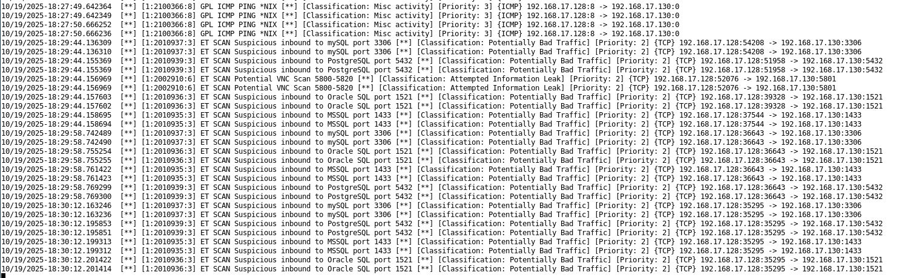
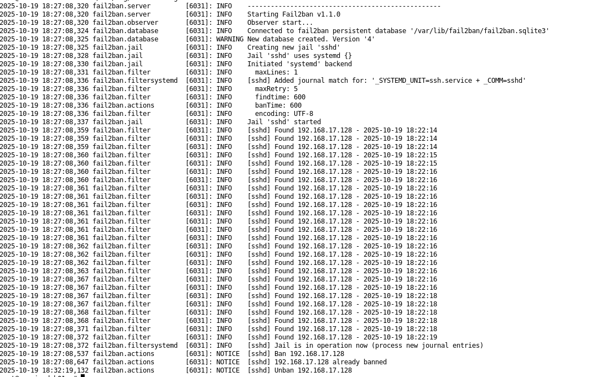
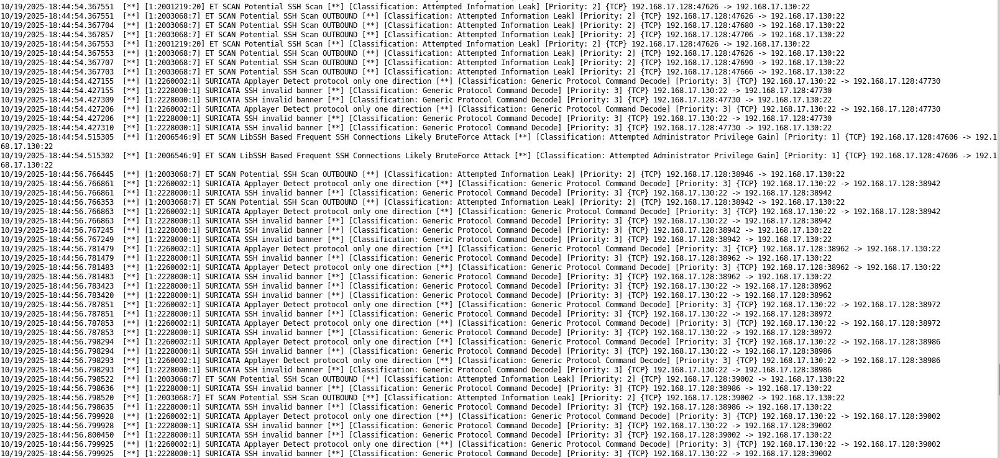
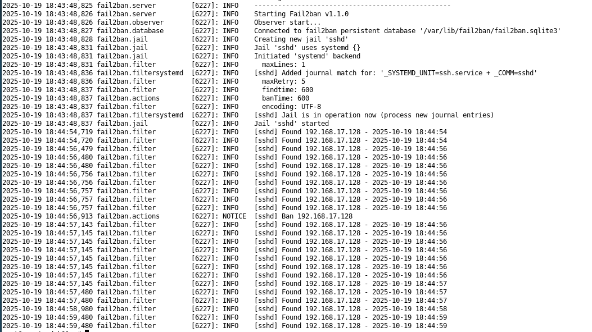

### Подготовка к выполнению заданий
1. Подготовка защищаемой системы:
- установите **Suricata**,
- установите **Fail2Ban**.
2. Подготовка системы злоумышленника: установите **nmap** и **thc-hydra** либо скачайте и установите **Kali linux**.
Обе системы должны находится в одной подсети.

### Задание 1. 
Проведите разведку системы и определите, какие сетевые службы запущены на защищаемой системе
**sudo nmap -sA < ip-адрес >**
**sudo nmap -sT < ip-адрес >**
**sudo nmap -sS < ip-адрес >**
**sudo nmap -sV < ip-адрес >**
По желанию можете поэкспериментировать с опциями: https://nmap.org/man/ru/man-briefoptions.html.
*В качестве ответа пришлите события, которые попали в логи Suricata и Fail2Ban, прокомментируйте результат.*

#### Решение 1

```
┌──(user㉿vm-nix-kali1)-[~]
└─$ ping 192.168.17.130 -c 4
PING 192.168.17.130 (192.168.17.130) 56(84) bytes of data.
64 bytes from 192.168.17.130: icmp_seq=1 ttl=64 time=0.581 ms
64 bytes from 192.168.17.130: icmp_seq=2 ttl=64 time=0.486 ms
64 bytes from 192.168.17.130: icmp_seq=3 ttl=64 time=0.523 ms
64 bytes from 192.168.17.130: icmp_seq=4 ttl=64 time=0.442 ms

--- 192.168.17.130 ping statistics ---
4 packets transmitted, 4 received, 0% packet loss, time 3054ms
rtt min/avg/max/mdev = 0.442/0.508/0.581/0.050 ms

Debian:
10/19/2025-18:09:29.549426  [**] [1:2100366:8] GPL ICMP PING *NIX [**] [Classification: Misc activity] [Priority: 3] {ICMP} 192.168.17.128:8 -> 192.168.17.130:0
10/19/2025-18:09:29.549441  [**] [1:2100366:8] GPL ICMP PING *NIX [**] [Classification: Misc activity] [Priority: 3] {ICMP} 192.168.17.128:8 -> 192.168.17.130:0
10/19/2025-18:09:30.573351  [**] [1:2100366:8] GPL ICMP PING *NIX [**] [Classification: Misc activity] [Priority: 3] {ICMP} 192.168.17.128:8 -> 192.168.17.130:0
10/19/2025-18:09:30.573342  [**] [1:2100366:8] GPL ICMP PING *NIX [**] [Classification: Misc activity] [Priority: 3] {ICMP} 192.168.17.128:8 -> 192.168.17.130:0
```

```
└─$ sudo nmap -sA 192.168.17.130
Starting Nmap 7.95 ( https://nmap.org ) at 2025-10-19 18:09 MSK
Nmap scan report for 192.168.17.130 (192.168.17.130)
Host is up (0.00022s latency).
All 1000 scanned ports on 192.168.17.130 (192.168.17.130) are in ignored states.
Not shown: 1000 unfiltered tcp ports (reset)
MAC Address: 00:0C:29:E4:E4:86 (VMware)

Nmap done: 1 IP address (1 host up) scanned in 0.22 seconds

Debian
Нет логов
```

```
└─$ sudo nmap -sT 192.168.17.130
Starting Nmap 7.95 ( https://nmap.org ) at 2025-10-19 18:13 MSK
Nmap scan report for 192.168.17.130 (192.168.17.130)
Host is up (0.00025s latency).
Not shown: 999 closed tcp ports (conn-refused)
PORT   STATE SERVICE
22/tcp open  ssh
MAC Address: 00:0C:29:E4:E4:86 (VMware)

Nmap done: 1 IP address (1 host up) scanned in 0.14 seconds

Debian:
10/19/2025-18:13:28.344702  [**] [1:2010937:3] ET SCAN Suspicious inbound to mySQL port 3306 [**] [Classification: Potentially Bad Traffic] [Priority: 2] {TCP} 192.168.17.128:49060 -> 192.168.17.130:3306
10/19/2025-18:13:28.344701  [**] [1:2010937:3] ET SCAN Suspicious inbound to mySQL port 3306 [**] [Classification: Potentially Bad Traffic] [Priority: 2] {TCP} 192.168.17.128:49060 -> 192.168.17.130:3306
10/19/2025-18:13:28.366844  [**] [1:2010936:3] ET SCAN Suspicious inbound to Oracle SQL port 1521 [**] [Classification: Potentially Bad Traffic] [Priority: 2] {TCP} 192.168.17.128:60198 -> 192.168.17.130:1521
10/19/2025-18:13:28.366845  [**] [1:2010936:3] ET SCAN Suspicious inbound to Oracle SQL port 1521 [**] [Classification: Potentially Bad Traffic] [Priority: 2] {TCP} 192.168.17.128:60198 -> 192.168.17.130:1521
10/19/2025-18:13:28.370188  [**] [1:2002910:6] ET SCAN Potential VNC Scan 5800-5820 [**] [Classification: Attempted Information Leak] [Priority: 2] {TCP} 192.168.17.128:56696 -> 192.168.17.130:5800
10/19/2025-18:13:28.370187  [**] [1:2002910:6] ET SCAN Potential VNC Scan 5800-5820 [**] [Classification: Attempted Information Leak] [Priority: 2] {TCP} 192.168.17.128:56696 -> 192.168.17.130:5800
10/19/2025-18:13:28.375651  [**] [1:2010935:3] ET SCAN Suspicious inbound to MSSQL port 1433 [**] [Classification: Potentially Bad Traffic] [Priority: 2] {TCP} 192.168.17.128:42162 -> 192.168.17.130:1433
10/19/2025-18:13:28.375650  [**] [1:2010935:3] ET SCAN Suspicious inbound to MSSQL port 1433 [**] [Classification: Potentially Bad Traffic] [Priority: 2] {TCP} 192.168.17.128:42162 -> 192.168.17.130:1433
10/19/2025-18:13:28.375728  [**] [1:2010939:3] ET SCAN Suspicious inbound to PostgreSQL port 5432 [**] [Classification: Potentially Bad Traffic] [Priority: 2] {TCP} 192.168.17.128:48830 -> 192.168.17.130:5432
10/19/2025-18:13:28.375728  [**] [1:2010939:3] ET SCAN Suspicious inbound to PostgreSQL port 5432 [**] [Classification: Potentially Bad Traffic] [Priority: 2] {TCP} 192.168.17.128:48830 -> 192.168.17.130:5432
```

```
└─$ sudo nmap -sS 192.168.17.130
Starting Nmap 7.95 ( https://nmap.org ) at 2025-10-19 18:14 MSK
Nmap scan report for 192.168.17.130 (192.168.17.130)
Host is up (0.00018s latency).
Not shown: 999 closed tcp ports (reset)
PORT   STATE SERVICE
22/tcp open  ssh
MAC Address: 00:0C:29:E4:E4:86 (VMware)

Nmap done: 1 IP address (1 host up) scanned in 0.18 seconds

Debian:
10/19/2025-18:14:35.865663  [**] [1:2010937:3] ET SCAN Suspicious inbound to mySQL port 3306 [**] [Classification: Potentially Bad Traffic] [Priority: 2] {TCP} 192.168.17.128:44141 -> 192.168.17.130:3306
10/19/2025-18:14:35.865663  [**] [1:2010937:3] ET SCAN Suspicious inbound to mySQL port 3306 [**] [Classification: Potentially Bad Traffic] [Priority: 2] {TCP} 192.168.17.128:44141 -> 192.168.17.130:3306
10/19/2025-18:14:35.880978  [**] [1:2010939:3] ET SCAN Suspicious inbound to PostgreSQL port 5432 [**] [Classification: Potentially Bad Traffic] [Priority: 2] {TCP} 192.168.17.128:44141 -> 192.168.17.130:5432
10/19/2025-18:14:35.880977  [**] [1:2010939:3] ET SCAN Suspicious inbound to PostgreSQL port 5432 [**] [Classification: Potentially Bad Traffic] [Priority: 2] {TCP} 192.168.17.128:44141 -> 192.168.17.130:5432
10/19/2025-18:14:35.881409  [**] [1:2002910:6] ET SCAN Potential VNC Scan 5800-5820 [**] [Classification: Attempted Information Leak] [Priority: 2] {TCP} 192.168.17.128:44141 -> 192.168.17.130:5800
10/19/2025-18:14:35.881410  [**] [1:2002910:6] ET SCAN Potential VNC Scan 5800-5820 [**] [Classification: Attempted Information Leak] [Priority: 2] {TCP} 192.168.17.128:44141 -> 192.168.17.130:5800
10/19/2025-18:14:35.882132  [**] [1:2010935:3] ET SCAN Suspicious inbound to MSSQL port 1433 [**] [Classification: Potentially Bad Traffic] [Priority: 2] {TCP} 192.168.17.128:44141 -> 192.168.17.130:1433
10/19/2025-18:14:35.882132  [**] [1:2010935:3] ET SCAN Suspicious inbound to MSSQL port 1433 [**] [Classification: Potentially Bad Traffic] [Priority: 2] {TCP} 192.168.17.128:44141 -> 192.168.17.130:1433
10/19/2025-18:14:35.883181  [**] [1:2010936:3] ET SCAN Suspicious inbound to Oracle SQL port 1521 [**] [Classification: Potentially Bad Traffic] [Priority: 2] {TCP} 192.168.17.128:44141 -> 192.168.17.130:1521
10/19/2025-18:14:35.883181  [**] [1:2010936:3] ET SCAN Suspicious inbound to Oracle SQL port 1521 [**] [Classification: Potentially Bad Traffic] [Priority: 2] {TCP} 192.168.17.128:44141 -> 192.168.17.130:1521
```

```
└─$ sudo nmap -sV 192.168.17.130
Starting Nmap 7.95 ( https://nmap.org ) at 2025-10-19 18:15 MSK
Nmap scan report for 192.168.17.130 (192.168.17.130)
Host is up (0.00041s latency).
Not shown: 999 closed tcp ports (reset)
PORT   STATE SERVICE VERSION
22/tcp open  ssh     OpenSSH 10.0p2 Debian 7 (protocol 2.0)
MAC Address: 00:0C:29:E4:E4:86 (VMware)
Service Info: OS: Linux; CPE: cpe:/o:linux:linux_kernel

Service detection performed. Please report any incorrect results at https://nmap.org/submit/ .
Nmap done: 1 IP address (1 host up) scanned in 0.40 seconds

10/19/2025-18:15:43.373761  [**] [1:2010937:3] ET SCAN Suspicious inbound to mySQL port 3306 [**] [Classification: Potentially Bad Traffic] [Priority: 2] {TCP} 192.168.17.128:50210 -> 192.168.17.130:3306
10/19/2025-18:15:43.373762  [**] [1:2010937:3] ET SCAN Suspicious inbound to mySQL port 3306 [**] [Classification: Potentially Bad Traffic] [Priority: 2] {TCP} 192.168.17.128:50210 -> 192.168.17.130:3306
10/19/2025-18:15:43.380524  [**] [1:2010936:3] ET SCAN Suspicious inbound to Oracle SQL port 1521 [**] [Classification: Potentially Bad Traffic] [Priority: 2] {TCP} 192.168.17.128:50210 -> 192.168.17.130:1521
10/19/2025-18:15:43.380525  [**] [1:2010936:3] ET SCAN Suspicious inbound to Oracle SQL port 1521 [**] [Classification: Potentially Bad Traffic] [Priority: 2] {TCP} 192.168.17.128:50210 -> 192.168.17.130:1521
10/19/2025-18:15:43.385661  [**] [1:2010935:3] ET SCAN Suspicious inbound to MSSQL port 1433 [**] [Classification: Potentially Bad Traffic] [Priority: 2] {TCP} 192.168.17.128:50210 -> 192.168.17.130:1433
10/19/2025-18:15:43.385662  [**] [1:2010935:3] ET SCAN Suspicious inbound to MSSQL port 1433 [**] [Classification: Potentially Bad Traffic] [Priority: 2] {TCP} 192.168.17.128:50210 -> 192.168.17.130:1433
10/19/2025-18:15:43.395172  [**] [1:2002910:6] ET SCAN Potential VNC Scan 5800-5820 [**] [Classification: Attempted Information Leak] [Priority: 2] {TCP} 192.168.17.128:50210 -> 192.168.17.130:5801
10/19/2025-18:15:43.398678  [**] [1:2010939:3] ET SCAN Suspicious inbound to PostgreSQL port 5432 [**] [Classification: Potentially Bad Traffic] [Priority: 2] {TCP} 192.168.17.128:50210 -> 192.168.17.130:5432
10/19/2025-18:15:43.395171  [**] [1:2002910:6] ET SCAN Potential VNC Scan 5800-5820 [**] [Classification: Attempted Information Leak] [Priority: 2] {TCP} 192.168.17.128:50210 -> 192.168.17.130:5801
10/19/2025-18:15:43.398678  [**] [1:2010939:3] ET SCAN Suspicious inbound to PostgreSQL port 5432 [**] [Classification: Potentially Bad Traffic] [Priority: 2] {TCP} 192.168.17.128:50210 -> 192.168.17.130:5432
```

Сканирование показывает, что открыт SSH порт.




При этом, что порт SSH Открыт kali вычислил:
```
──(user㉿vm-nix-kali1)-[~]
└─$ sudo nmap -sA 192.168.17.130                    
Starting Nmap 7.95 ( https://nmap.org ) at 2025-10-19 18:29 MSK
Nmap scan report for 192.168.17.130 (192.168.17.130)
Host is up (0.00054s latency).
Not shown: 999 unfiltered tcp ports (reset)
PORT   STATE    SERVICE
22/tcp filtered ssh
MAC Address: 00:0C:29:E4:E4:86 (VMware)

Nmap done: 1 IP address (1 host up) scanned in 0.23 seconds
                                                                                                          
┌──(user㉿vm-nix-kali1)-[~]
└─$ sudo nmap -sT 192.168.17.130                    
Starting Nmap 7.95 ( https://nmap.org ) at 2025-10-19 18:29 MSK
Nmap scan report for 192.168.17.130 (192.168.17.130)
Host is up (0.00025s latency).
All 1000 scanned ports on 192.168.17.130 (192.168.17.130) are in ignored states.
Not shown: 1000 closed tcp ports (conn-refused)
MAC Address: 00:0C:29:E4:E4:86 (VMware)

Nmap done: 1 IP address (1 host up) scanned in 0.14 seconds
                                                                                                          
┌──(user㉿vm-nix-kali1)-[~]
└─$ sudo nmap -sS 192.168.17.130                    
Starting Nmap 7.95 ( https://nmap.org ) at 2025-10-19 18:29 MSK
Nmap scan report for 192.168.17.130 (192.168.17.130)
Host is up (0.00013s latency).
Not shown: 999 closed tcp ports (reset)
PORT   STATE    SERVICE
22/tcp filtered ssh
MAC Address: 00:0C:29:E4:E4:86 (VMware)

Nmap done: 1 IP address (1 host up) scanned in 0.24 seconds
                                                                                                          
┌──(user㉿vm-nix-kali1)-[~]
└─$ sudo nmap -sV 192.168.17.130                    
Starting Nmap 7.95 ( https://nmap.org ) at 2025-10-19 18:30 MSK
Nmap scan report for 192.168.17.130 (192.168.17.130)
Host is up (0.00011s latency).
Not shown: 999 closed tcp ports (reset)
PORT   STATE    SERVICE VERSION
22/tcp filtered ssh
MAC Address: 00:0C:29:E4:E4:86 (VMware)

Service detection performed. Please report any incorrect results at https://nmap.org/submit/ .
Nmap done: 1 IP address (1 host up) scanned in 0.35 seconds
```



### Задание 2
Проведите атаку на подбор пароля для службы SSH:
**hydra -L users.txt -P pass.txt < ip-адрес > ssh**
1. Настройка **hydra**: 
 - создайте два файла: **users.txt** и **pass.txt**;
 - в каждой строчке первого файла должны быть имена пользователей, второго — пароли. В нашем случае это могут быть случайные строки, но ради эксперимента можете добавить имя и пароль существующего пользователя.
Дополнительная информация по **hydra**: https://kali.tools/?p=1847.

2. Включение защиты SSH для Fail2Ban:
-  открыть файл /etc/fail2ban/jail.conf,
-  найти секцию **ssh**,
-  установить **enabled**  в **true**.
Дополнительная информация по **Fail2Ban**:https://putty.org.ru/articles/fail2ban-ssh.html.
*В качестве ответа пришлите события, которые попали в логи Suricata и Fail2Ban, прокомментируйте результат.*

#### Решение 2
Содержимое файлов
```
──(user㉿vm-nix-kali1)-[~]
└─$ cat pass.txt
123456
password
12345678
qwerty
123456789
12345
1234
111111
1234567
admin
usr
user
uuserrrrrrrr
                                                                                                          
┌──(user㉿vm-nix-kali1)-[~]
└─$ cat user.txt
root
admin
user
test
guest
ubuntu
debian
oracle
postgres
nginx
```
Команда:
```
hydra -L user.txt -P pass.txt 192.168.17.130 ssh
```

Логи:
```
──(user㉿vm-nix-kali1)-[~]
└─$ hydra -L user.txt -P pass.txt 192.168.17.130 ssh
Hydra v9.5 (c) 2023 by van Hauser/THC & David Maciejak - Please do not use in military or secret service organizations, or for illegal purposes (this is non-binding, these *** ignore laws and ethics anyway).

Hydra (https://github.com/vanhauser-thc/thc-hydra) starting at 2025-10-19 18:44:54
[WARNING] Many SSH configurations limit the number of parallel tasks, it is recommended to reduce the tasks: use -t 4
[DATA] max 16 tasks per 1 server, overall 16 tasks, 130 login tries (l:10/p:13), ~9 tries per task
[DATA] attacking ssh://192.168.17.130:22/
[ERROR] all children were disabled due too many connection errors
0 of 1 target completed, 0 valid password found
[INFO] Writing restore file because 2 server scans could not be completed
[ERROR] 1 target was disabled because of too many errors
[ERROR] 1 targets did not complete
Hydra (https://github.com/vanhauser-thc/thc-hydra) finished at 2025-10-19 18:45:33

```

Suracata сразу обнаржил, что вероятно идет перебор SSHЖ
```
10/19/2025-18:44:54.367551  [**] [1:2001219:20] ET SCAN Potential SSH Scan [**] [Classification: Attempted Information Leak] [Priority: 2] {TCP} 192.168.17.128:47626 -> 192.168.17.130:22
10/19/2025-18:44:54.515305  [**] [1:2006546:9] ET SCAN LibSSH Based Frequent SSH Connections Likely BruteForce Attack [**] [Classification: Attempted Administrator Privilege Gain] [Priority: 1] {TCP} 192.168.17.128:47606 -> 192.168.17.130:22
```


Fail2Ban обнаружил, что идут попытки подключения и после 10 неудачных попыток заблокировал атакуюший хост.
```
2025-10-19 18:44:54,719 fail2ban.filter         [6227]: INFO    [sshd] Found 192.168.17.128 - 2025-10-19 18:44:54
2025-10-19 18:44:54,720 fail2ban.filter         [6227]: INFO    [sshd] Found 192.168.17.128 - 2025-10-19 18:44:54
2025-10-19 18:44:56,479 fail2ban.filter         [6227]: INFO    [sshd] Found 192.168.17.128 - 2025-10-19 18:44:56
2025-10-19 18:44:56,480 fail2ban.filter         [6227]: INFO    [sshd] Found 192.168.17.128 - 2025-10-19 18:44:56
2025-10-19 18:44:56,480 fail2ban.filter         [6227]: INFO    [sshd] Found 192.168.17.128 - 2025-10-19 18:44:56
2025-10-19 18:44:56,756 fail2ban.filter         [6227]: INFO    [sshd] Found 192.168.17.128 - 2025-10-19 18:44:56
2025-10-19 18:44:56,756 fail2ban.filter         [6227]: INFO    [sshd] Found 192.168.17.128 - 2025-10-19 18:44:56
2025-10-19 18:44:56,757 fail2ban.filter         [6227]: INFO    [sshd] Found 192.168.17.128 - 2025-10-19 18:44:56
2025-10-19 18:44:56,757 fail2ban.filter         [6227]: INFO    [sshd] Found 192.168.17.128 - 2025-10-19 18:44:56
2025-10-19 18:44:56,757 fail2ban.filter         [6227]: INFO    [sshd] Found 192.168.17.128 - 2025-10-19 18:44:56
2025-10-19 18:44:56,913 fail2ban.actions        [6227]: NOTICE  [sshd] Ban 192.168.17.128

```
