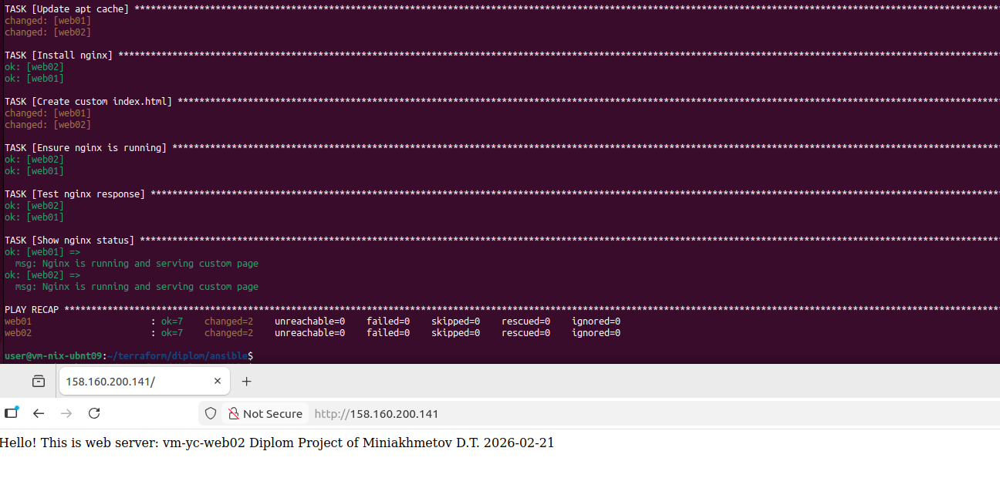
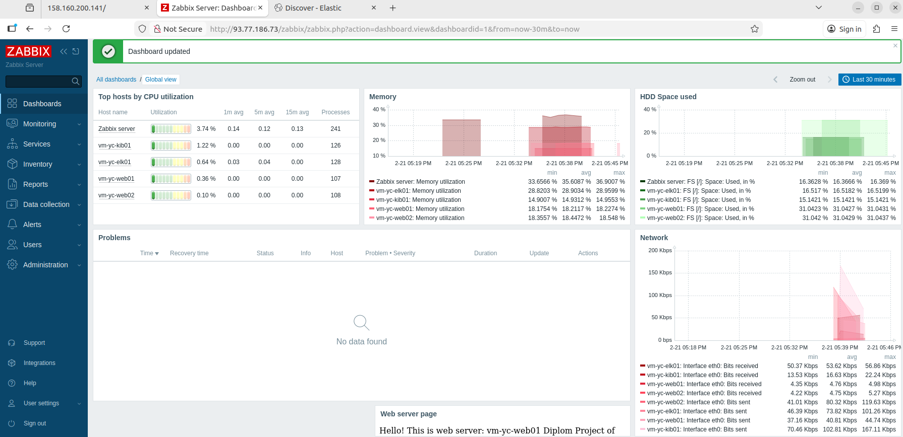
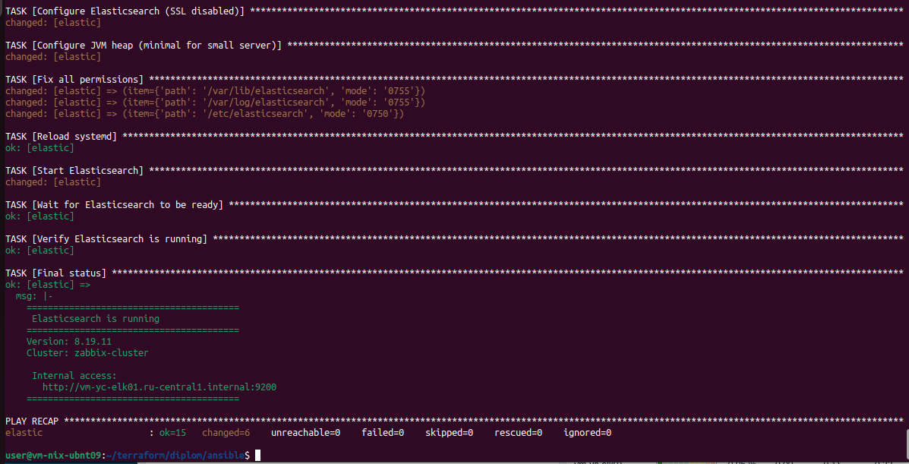
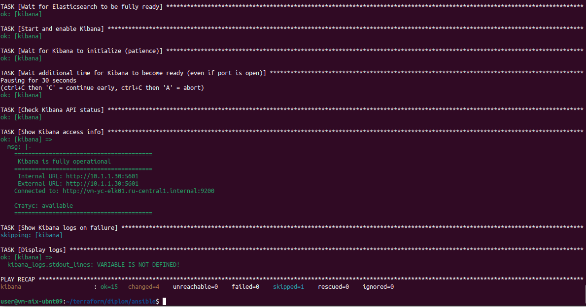
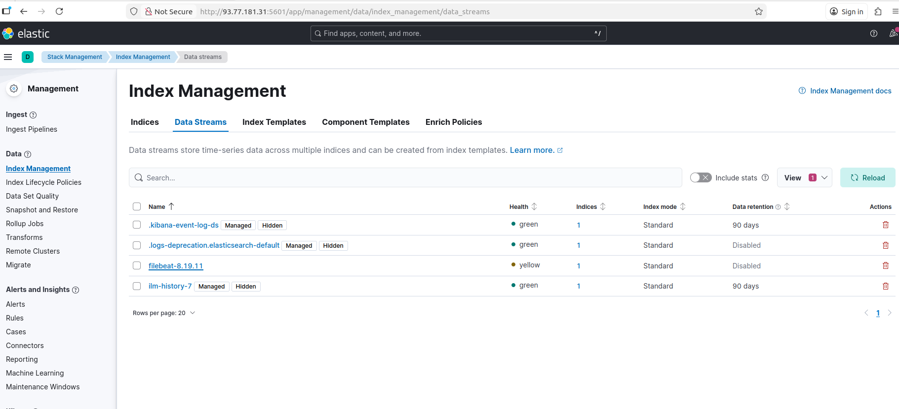
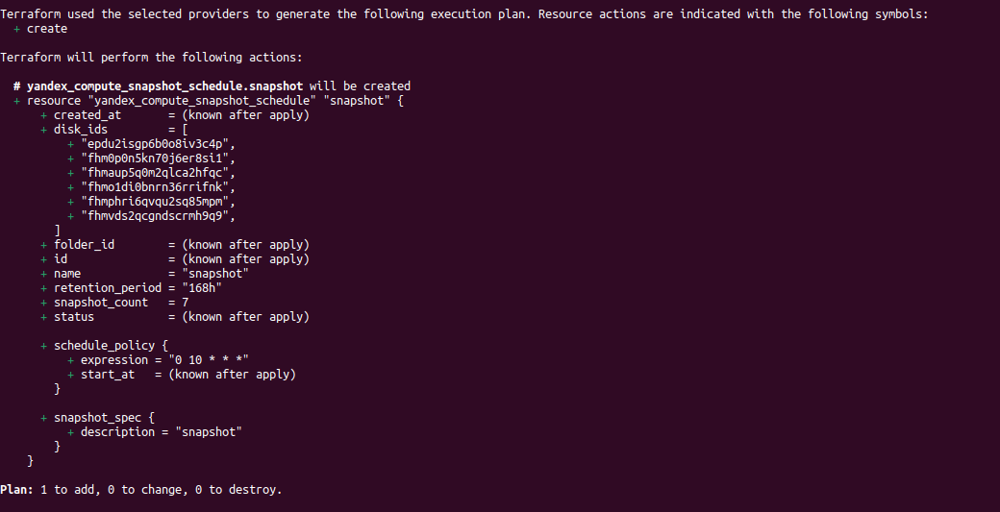
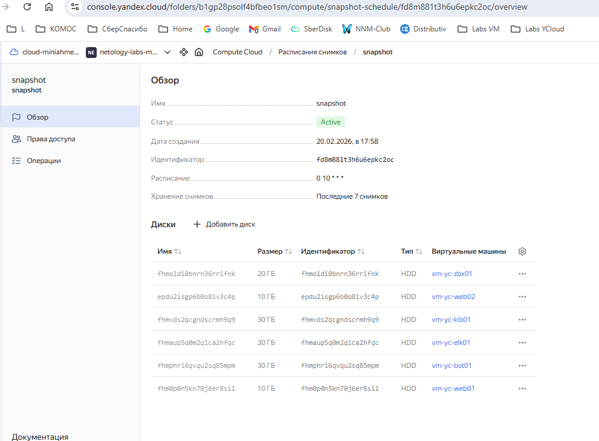

#  Дипломная работа по профессии «Системный администратор»


---------

**Скорее всего сервера перед проверкой уже выключатся (грант закончится). Если потребуется включить - свяжитесь через чат/почту и т.п. и договоримся о времени включения**

---------

# 1. Общая структура проекта

```
user@vm-nix-ubnt09:~/terraform/diplom$ tree -L 3
├── ansible
│   ├── ansible.cfg                  - Основной конфигурационный файл Ansible
│   ├── elasticsearch.yml            - Плейбук для установки и настройки Elasticsearch
│   ├── filebeat.yml                 - Плейбук для установки и настройки Filebeat на веб-серверах
│   ├── hosts.cfg                    - Сгенерированный Terraform инвентарный файл для работы Ansible
│   ├── install-postgresql.yml       - Плейбук для установки и первичной настройки PostgreSQL на сервере Zabbix
│   ├── kibana.yml                   - Плейбук для установки и настройки Kibana
│   ├── nginx-setup.yml              - Плейбук для установки Nginx на веб-серверы и создания страницы
│   ├── site.yml                     - Главный плейбук
│   ├── templates                    - Каталог конфигурационных файлов
│   │   ├── elasticsearch.yml.j2     - Шаблон конфигурации для Elasticsearch
│   │   ├── filebeat-nginx.yml.j2    - Шаблон конфигурации модуля Filebeat для сбора логов Nginx
│   │   ├── filebeat.yml.j2          - Шаблон конфигурации Filebeat
│   │   ├── kibana.yml.j2            - Шаблон конфигурации для Kibana
│   │   ├── zabbix_agentd.conf.j2    - Шаблон конфигурации для Zabbix-агента
│   │   └── zabbix.conf.php.j2       - Шаблон конфигурационного файла для веб-интерфейса Zabbix
│   ├── vars                         - Каталог переменных Ansible
│   │   └── elastic.yml              - Переменные для настройки Elasticsearch, Kibana и Filebeat
│   ├── vault                        - Каталог для хранения секретов
│   │   ├── vault.yml                - Зашифрованный файл с паролями
│   ├── zabbix-agents.yml            - Плейбук для установки и настройки Zabbix-агентов
│   ├── zabbix-server.yml            - Плейбук для первоначальной установки Zabbix-сервера
│   └── zabbix-web-setup.yml         - Плейбук для настройки веб-интерфейса Zabbix-сервера и установки пароля администратора
├── cloud-init-nginx.yml             - Cloud-init конфигурация для веб-серверов
├── cloud-init.yml                   - Cloud-init конфигурация для всех серверов
├── hosts.tf                         - Terraform-файл, генерирующий ansible/hosts.cfg из шаблона hosts.tpl
├── hosts.tpl                        - Шаблон инвентарного файла Ansible
├── main.tf                          - Основной файл конфигурации Terraform
├── network.tf                       - Terraform-файл, описывающий сетевую инфраструктуру
├── outputs.tf                       - Terraform-файл, определяющий выходные переменные
├── providers.tf                     - Terraform-файл для настройки провайдеров
├── security_group.tf                - Terraform-файл с описанием всех групп безопасности и правил МСЭ
├── snapshot.tf                      - Terraform-файл для настройки расписания создания snapshot's
├── variables.tf                     - Terraform-файл с объявлением переменных
└── .gitignore                       - Файл со списком исключений для публикации в Git

Содержимое gitignore:
- cloud-init.yml 
- cloud-init-nginx.yml
- /ansible/vault/
```

```
Для создание проекта потребуется:
1. Сформировать SSH ключи.
2. Сформировать vault-файл
3. Настроить провайдера yandex (создать файл .terraformrc, установить CLI)
4. Оредактировать файл variables.tf, указать свои данные для подключения к облаку
5. Создать инфраструктуру через Terraform Apply
6. Выполнить настройку серверов через запуск плейбука ansible/site.yml или последовательного запуска плейбуков:
а) Настройка nginx на web-серверах: 
nginx-setup.yml
б) Настройка сервера Zabbix и Установка агентов
nstall-postgresql.yml
zabbix-server.yml
zabbix-web-setup.yml
zabbix-agents.yml
в) Настройка серверов ELK-стека
elasticsearch.yml
kibana.yml
filebeat.yml
7. Настройка мониторинга и сбора, отображения логов на целевых серверах
```

# 2. Скрипты Terraform: Создание серверного окружения в Яндекс облаке.

```
├── ansible
│   ├── ansible.cfg                  - Основной конфигурационный файл Ansible
│   ├── hosts.cfg                    - Сгенерированный Terraform инвентарный файл для работы Ansible
│   ├── nginx-setup.yml              - Плейбук для установки Nginx на веб-серверы и создания страницы
├── cloud-init-nginx.yml             - Cloud-init конфигурация для веб-серверов
├── cloud-init.yml                   - Cloud-init конфигурация для всех серверов
├── hosts.tf                         - Terraform-файл, генерирующий ansible/hosts.cfg из шаблона hosts.tpl
├── hosts.tpl                        - Шаблон инвентарного файла Ansible
├── main.tf                          - Основной файл конфигурации Terraform
├── network.tf                       - Terraform-файл, описывающий сетевую инфраструктуру
├── outputs.tf                       - Terraform-файл, определяющий выходные переменные
├── providers.tf                     - Terraform-файл для настройки провайдеров
├── security_group.tf                - Terraform-файл с описанием всех групп безопасности и правил МСЭ
├── variables.tf                     - Terraform-файл с объявлением переменных
└── .gitignore                       - Файл со списком исключений для публикации в Git
```

```
Содержимое cloud-init.yml:
#cloud-config
users:
  - name: user
    groups: sudo
    shell: /bin/bash
    sudo: ["ALL=(ALL) NOPASSWD:ALL"]
    ssh_authorized_keys:                        - Тут указан SSH ключ
 
package_update: true
package_upgrade: true

packages:
  - python3
  - python3-pip
  - python3-venv
# - nginx                                       - Дополнительная строка в файле cloud-init-nginx.yml

runcmd:
  - chmod 700 /home/user/.ssh
  - chmod 600 /home/user/.ssh/authorized_keys
  - chown -R user:user /home/user/.ssh
# - systemctl enable nginx                      - Дополнительная строка в файле cloud-init-nginx.yml
# - systemctl start nginx                       - Дополнительная строка в файле cloud-init-nginx.yml
```

## 2.1. Результат выполнения Terraform скрипта. Сервера созданы и видны в консоли Yandex Cloud


Содержимое файла hosts.cfg 
```
user@vm-nix-ubnt09:~/terraform/diplom$ cat ansible/hosts.cfg 
[all:vars]
ansible_user=user
ansible_ssh_private_key_file=~/.ssh/ansible
ansible_ssh_common_args="-o ProxyCommand=\"ssh -q user@93.77.176.83 -i ~/.ssh/ansible -W %h:%p\""

[bastion]
bastion ansible_host=93.77.176.83

[nginx]
web01 ansible_host=vm-yc-web01.ru-central1.internal
web02 ansible_host=vm-yc-web02.ru-central1.internal

[zabbix]
zabbix ansible_host=vm-yc-zbx01.ru-central1.internal

[kibana]
kibana ansible_host=vm-yc-kib01.ru-central1.internal

[elastic]
elastic ansible_host=vm-yc-elk01.ru-central1.internal

[web:children]
nginx

[elk:children]
elastic
kibana

[all:children]
bastion
nginx
zabbix
elk
```
## 2.2. Создана Target Group. WEB-сервера включены в Target Group.


## 2.3. Создана Backend Group. Backends настроены на Target group, ранее созданную. Настроен healthcheck на корень (/) и порт 80, протокол HTTP


## 2.4. Создан HTTP Router. Настроен ну группу Backend, созданную ранее.


## 2.5. Создан Application load balancer для распределения трафика на веб-сервера, созданные ранее. Указан HTTP router, созданный ранее, задан listener тип auto, порт 80


## 2.6. Сеть настроена в соответствии с заданием.
```
Доступ к серверам организован через сервер Bastion (vm-yc-bst01). Прямого доступв по SSH к серверам нет.
Из сети доступны ресурсы:
  Application Load Balancer по порту http 80 - Публикация приложения 
  Сервер Kibana по порту 5601 - Сервер просмотра логов
  Сервер Zabbix по порту 80, по адресу /zabbix - Сервер монитринга
```
Список подсетей Yandex Cloud:


Список групп безопасности:


Группа безопасности Bastion-SG:


## 2.7. Выполнена установка Nginx на веб-серверы (vm-yc-web01 и vm-yc-web02) и создание страницы 
```
ansible-playbook -i hosts.cfg nginx-setup.yml --vault-password-file .vault_pass
```


## 2.8. Тестирование работы

## 2.8.1. Тестирование Работы сайта 
```
`curl -v <публичный IP балансера>:80` 
```


## 2.8.2. Тестирование подключения к серверам через Bastion (vm-yc-bst01)


# 3. Настройка мониторинга

```
├── ansible
│   ├── hosts.cfg                    - Сгенерированный Terraform инвентарный файл для работы Ansible
│   ├── install-postgresql.yml       - Плейбук для установки и первичной настройки PostgreSQL на сервере Zabbix
│   ├── templates                    - Каталог конфигурационных файлов
│   │   ├── zabbix_agentd.conf.j2    - Шаблон конфигурации для Zabbix-агента
│   │   └── zabbix.conf.php.j2       - Шаблон конфигурационного файла для веб-интерфейса Zabbix
│   ├── vault                        - Каталог для хранения секретов
│   │   ├── vault.yml                - Зашифрованный файл с паролями
│   ├── zabbix-agents.yml            - Плейбук для установки и настройки Zabbix-агентов
│   ├── zabbix-server.yml            - Плейбук для первоначальной установки Zabbix-сервера
│   └── zabbix-web-setup.yml         - Плейбук для настройки веб-интерфейса Zabbix-сервера и установки пароля администратора
```

## 3.1. Создал хранилище секретов
```
│   ├── vault                        - Каталог для хранения секретов
│   │   ├── vault.yml                - Зашифрованный файл с паролями

Скриншота не осталось.
```

## 3.2. Установил PostgreSQL 16 на сервер Zabbix (vm-yc-zbx01)
```
ansible-playbook -i hosts.cfg install-postgresql.yml --vault-password-file .vault_pass
```


## 3.3. Установил серверную часть Zabbix. Настроили web-интерфейс и установили пароль администратора
```
ansible-playbook -i hosts.cfg zabbix-server.yml --vault-password-file .vault_pass
ansible-playbook -i hosts.cfg zabbix-web-setup.yml --vault-password-file .vault_pass
```


## 3.4. Установил агенты Zabbix на все сервера кроме bastion.
```
ansible-playbook -i hosts.cfg zabbix-agents.yml --vault-password-file .vault_pass
```


## 3.5. Настроил консоль мониторинга


Пересоздавал сервера много раз, последний вариант страницы мониторинга.



# 4. Настройка логирования 
```
├── ansible
│   ├── elasticsearch.yml            - Плейбук для установки и настройки Elasticsearch
│   ├── filebeat.yml                 - Плейбук для установки и настройки Filebeat на веб-серверах
│   ├── kibana.yml                   - Плейбук для установки и настройки Kibana
│   ├── templates                    - Каталог конфигурационных файлов
│   │   ├── elasticsearch.yml.j2     - Шаблон конфигурации для Elasticsearch
│   │   ├── filebeat-nginx.yml.j2    - Шаблон конфигурации модуля Filebeat для сбора логов Nginx
│   │   ├── filebeat.yml.j2          - Шаблон конфигурации Filebeat
│   │   ├── kibana.yml.j2            - Шаблон конфигурации для Kibana
│   ├── vars                         - Каталог переменных Ansible
│   │   └── elastic.yml              - Переменные для настройки Elasticsearch, Kibana и Filebeat
```

## 4.1. Выполнена установка Elasticsearch на сервере vm-yc-elk01
```
ansible-playbook -i hosts.cfg elasticsearch.yml --vault-password-file .vault_pass
```


## 4.2. Выполнена установка Kibana на сервере vm-yc-kib01
```
ansible-playbook -i hosts.cfg kibana.yml --vault-password-file .vault_pass
```


## 4.3. Выполнена установка Filebeat на web-сервера (vm-yc-web01 и vm-yc-web02)
```
ansible-playbook -i hosts.cfg filebeat.yml --vault-password-file .vault_pass
```


## 4.4. Проверки
```
Filebeat работает
```


```
Данные поступают в Elasticsearch, отображаются в Kibana
```


# 5. Резервное копирование
```
├── snapshot.tf                      - Terraform-файл для настройки расписания создания snapshot's

Создано ежедневное расписание snapshot дисков виртуальных машин. Время жизки snapshot - неделя. 
```

Результат Terraform Apply после применения конфигураии.


Расписание snapshot в Yandex Cloud

