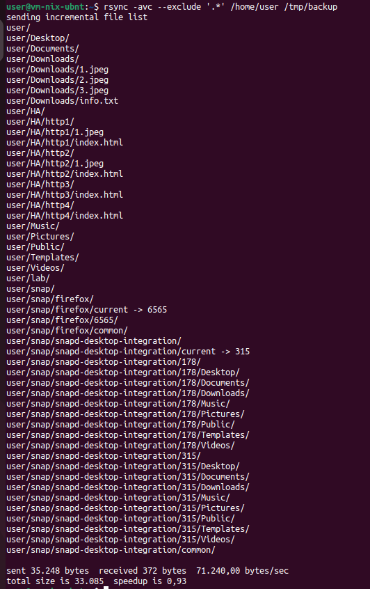
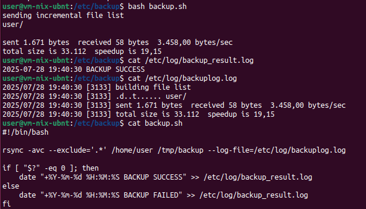
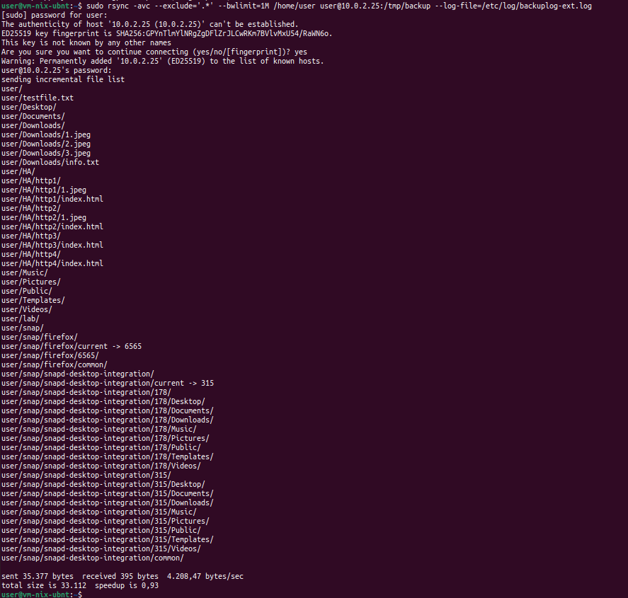
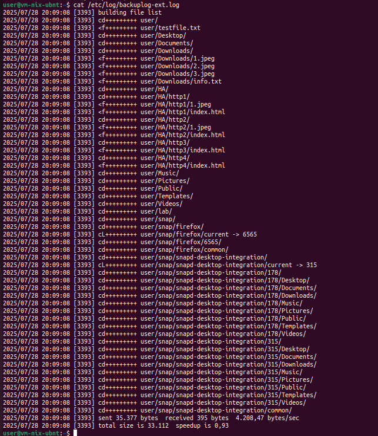
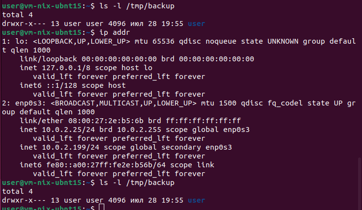

# Домашнее задание к занятию 3 «Резервное копирование»

### Задание 1
- Составьте команду rsync, которая позволяет создавать зеркальную копию домашней директории пользователя в директорию `/tmp/backup`
- Необходимо исключить из синхронизации все директории, начинающиеся с точки (скрытые)
- Необходимо сделать так, чтобы rsync подсчитывал хэш-суммы для всех файлов, даже если их время модификации и размер идентичны в источнике и приемнике.
- На проверку направить скриншот с командой и результатом ее выполнения

```
user@vm-nix-ubnt:~$ rsync -avc --exclude '.*' /home/user /tmp/backup
```



### Задание 2
- Написать скрипт и настроить задачу на регулярное резервное копирование домашней директории пользователя с помощью rsync и cron.
- Резервная копия должна быть полностью зеркальной
- Резервная копия должна создаваться раз в день, в системном логе должна появляться запись об успешном или неуспешном выполнении операции
- Резервная копия размещается локально, в директории `/tmp/backup`
- На проверку направить файл crontab и скриншот с результатом работы утилиты.

```
ser@vm-nix-ubnt:/etc/backup$ cat backup.sh
#!/bin/bash

rsync -avc --exclude='.*' /home/user /tmp/backup --log-file=/etc/log/backuplog.log

if [ "$?" -eq 0 ]; then
    date "+%Y-%m-%d %H:%M:%S BACKUP SUCCESS" >> /etc/log/backup_result.log
else
    date "+%Y-%m-%d %H:%M:%S BACKUP FAILED" >> /etc/log/backup_result.log
fi
```
```
0 0 * * *  bash /etc/backub/backup.sh
```




### Задание 3*
- Настройте ограничение на используемую пропускную способность rsync до 1 Мбит/c
- Проверьте настройку, синхронизируя большой файл между двумя серверами
- На проверку направьте команду и результат ее выполнения в виде скриншота
'''
user@vm-nix-ubnt:~$ sudo rsync -avc --exclude='.*' --bwlimit=1M /home/user user@10.0.2.25:/tmp/backup --log-file=/etc/log/backuplog-ext.log
'''

'''user@vm-nix-ubnt:~$ sudo rsync -avc --exclude='.*' --bwlimit=1M /home/user user@10.0.2.25:/tmp/backup --log-file=/etc/log/backuplog-ext.log
[sudo] password for user: 
The authenticity of host '10.0.2.25 (10.0.2.25)' can't be established.
ED25519 key fingerprint is SHA256:GPYnTlmYlNRgZgDFlZrJLCwRKm7BVlvMxU54/RaWN6o.
This key is not known by any other names
Are you sure you want to continue connecting (yes/no/[fingerprint])? yes
Warning: Permanently added '10.0.2.25' (ED25519) to the list of known hosts.
user@10.0.2.25's password: 
sending incremental file list
user/
user/testfile.txt
user/Desktop/
user/Documents/
user/Downloads/
user/Downloads/1.jpeg
user/Downloads/2.jpeg
user/Downloads/3.jpeg
user/Downloads/info.txt
user/HA/
user/HA/http1/
user/HA/http1/1.jpeg
user/HA/http1/index.html
user/HA/http2/
user/HA/http2/1.jpeg
user/HA/http2/index.html
user/HA/http3/
user/HA/http3/index.html
user/HA/http4/
user/HA/http4/index.html
user/Music/
user/Pictures/
user/Public/
user/Templates/
user/Videos/
user/lab/
user/snap/
user/snap/firefox/
user/snap/firefox/current -> 6565
user/snap/firefox/6565/
user/snap/firefox/common/
user/snap/snapd-desktop-integration/
user/snap/snapd-desktop-integration/current -> 315
user/snap/snapd-desktop-integration/178/
user/snap/snapd-desktop-integration/178/Desktop/
user/snap/snapd-desktop-integration/178/Documents/
user/snap/snapd-desktop-integration/178/Downloads/
user/snap/snapd-desktop-integration/178/Music/
user/snap/snapd-desktop-integration/178/Pictures/
user/snap/snapd-desktop-integration/178/Public/
user/snap/snapd-desktop-integration/178/Templates/
user/snap/snapd-desktop-integration/178/Videos/
user/snap/snapd-desktop-integration/315/
user/snap/snapd-desktop-integration/315/Desktop/
user/snap/snapd-desktop-integration/315/Documents/
user/snap/snapd-desktop-integration/315/Downloads/
user/snap/snapd-desktop-integration/315/Music/
user/snap/snapd-desktop-integration/315/Pictures/
user/snap/snapd-desktop-integration/315/Public/
user/snap/snapd-desktop-integration/315/Templates/
user/snap/snapd-desktop-integration/315/Videos/
user/snap/snapd-desktop-integration/common/

sent 35.377 bytes  received 395 bytes  4.208,47 bytes/sec
total size is 33.112  speedup is 0,93
'''




### Задание 4*
- Напишите скрипт, который будет производить инкрементное резервное копирование домашней директории пользователя с помощью rsync на другой сервер
- Скрипт должен удалять старые резервные копии (сохранять только последние 5 штук)
- Напишите скрипт управления резервными копиями, в нем можно выбрать резервную копию и данные восстановятся к состоянию на момент создания данной резервной копии.
- На проверку направьте скрипт и скриншоты, демонстрирующие его работу в различных сценариях.
