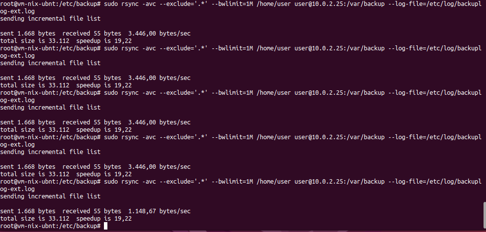

# Домашнее задание к занятию 3 «Резервное копирование»

### Задание 1
- Составьте команду rsync, которая позволяет создавать зеркальную копию домашней директории пользователя в директорию `/tmp/backup`
- Необходимо исключить из синхронизации все директории, начинающиеся с точки (скрытые)
- Необходимо сделать так, чтобы rsync подсчитывал хэш-суммы для всех файлов, даже если их время модификации и размер идентичны в источнике и приемнике.
- На проверку направить скриншот с командой и результатом ее выполнения

### Решение 1

```
user@vm-nix-ubnt:~$ rsync -avc --exclude '.*' /home/user /tmp/backup
```


### Задание 2
- Написать скрипт и настроить задачу на регулярное резервное копирование домашней директории пользователя с помощью rsync и cron.
- Резервная копия должна быть полностью зеркальной
- Резервная копия должна создаваться раз в день, в системном логе должна появляться запись об успешном или неуспешном выполнении операции
- Резервная копия размещается локально, в директории `/tmp/backup`
- На проверку направить файл crontab и скриншот с результатом работы утилиты.

### Решение 2

```
ser@vm-nix-ubnt:/etc/backup$ cat backup.sh
#!/bin/bash

rsync -avc --exclude='.*' /home/user /tmp/backup --log-file=/etc/log/backuplog.log

if [ "$?" -eq 0 ]; then
    date "+%Y-%m-%d %H:%M:%S BACKUP SUCCESS" >> /etc/log/backup_result.log
else
    date "+%Y-%m-%d %H:%M:%S BACKUP FAILED" >> /etc/log/backup_result.log
fi
```
```
0 0 * * *  bash /etc/backub/backup.sh
```


### Задание 3*
- Настройте ограничение на используемую пропускную способность rsync до 1 Мбит/c
- Проверьте настройку, синхронизируя большой файл между двумя серверами
- На проверку направьте команду и результат ее выполнения в виде скриншота


### Решение 3*
```
user@vm-nix-ubnt:~$ sudo rsync -avc --exclude='.*' --bwlimit=1M /home/user user@10.0.2.25:/tmp/backup --log-file=/etc/log/backuplog-ext.log
```


### Задание 4*
- Напишите скрипт, который будет производить инкрементное резервное копирование домашней директории пользователя с помощью rsync на другой сервер
- Скрипт должен удалять старые резервные копии (сохранять только последние 5 штук)
- Напишите скрипт управления резервными копиями, в нем можно выбрать резервную копию и данные восстановятся к состоянию на момент создания данной резервной копии.
- На проверку направьте скрипт и скриншоты, демонстрирующие его работу в различных сценариях.

### Решение 4

- Cron на сервере хранения бекапов
```
root@vm-nix-ubnt:/etc/backup# crontab -l
# m h  dom mon dow   command
0 0 * * * sudo rsync -avc --exclude='.*' --bwlimit=1M /home/user user@10.0.2.25:/var/backup --log-file=/etc/log/backuplog-ext.log
```

- Скрины выполнения




- Текст bash скрипта для inc backup
```
root@vm-nix-ubnt15:/etc/backup# cat backup_inc.sh
#!/bin/bash

rsync -avz --delete /var/backup /var/backup_arch/current
cd /var/backup_arch && cp -al current snapshots/snap_$(date +%s)

SNAP_DIR="/var/backup_arch/snapshots/"
COUNT_SNAPS=$(ls -1 ${SNAP_DIR} | wc -l)
OLDEST=$(ls -1 ${SNAP_DIR} | sort | head -n 1)

echo "SNAP COUNT: $COUNT_SNAPS"
echo "OLDEST SNAPSHOT: $OLDEST"

if [[ $COUNT_SNAPS -gt 5 ]]; then
    rm -rf "${SNAP_DIR}/${OLDEST}"
fi
```

- Cron на сервере хранения бекапов
```
00 01 * * * bash /etc/backup/backup_inc.sh
```
