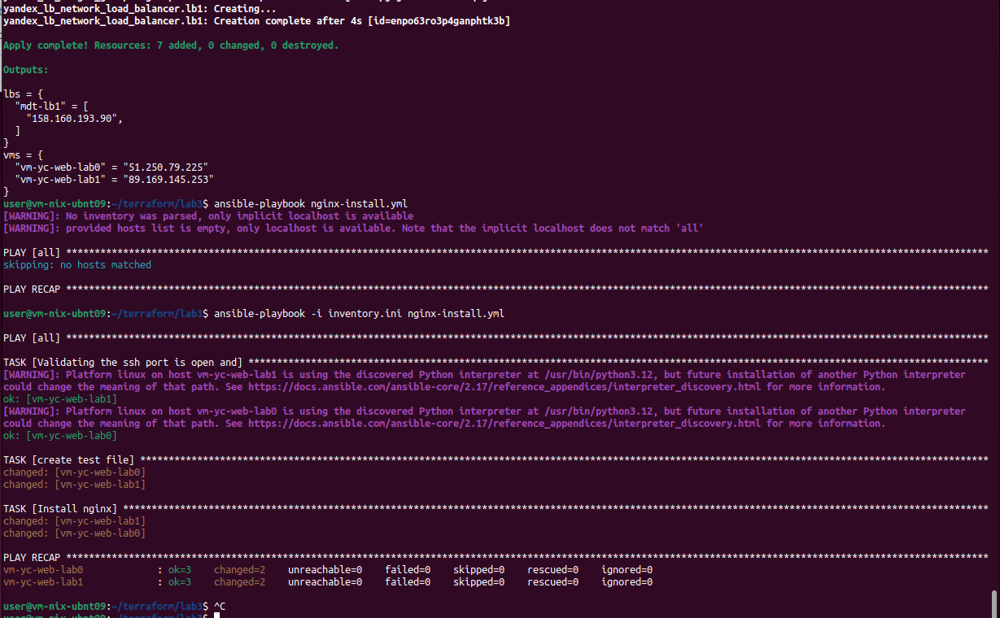
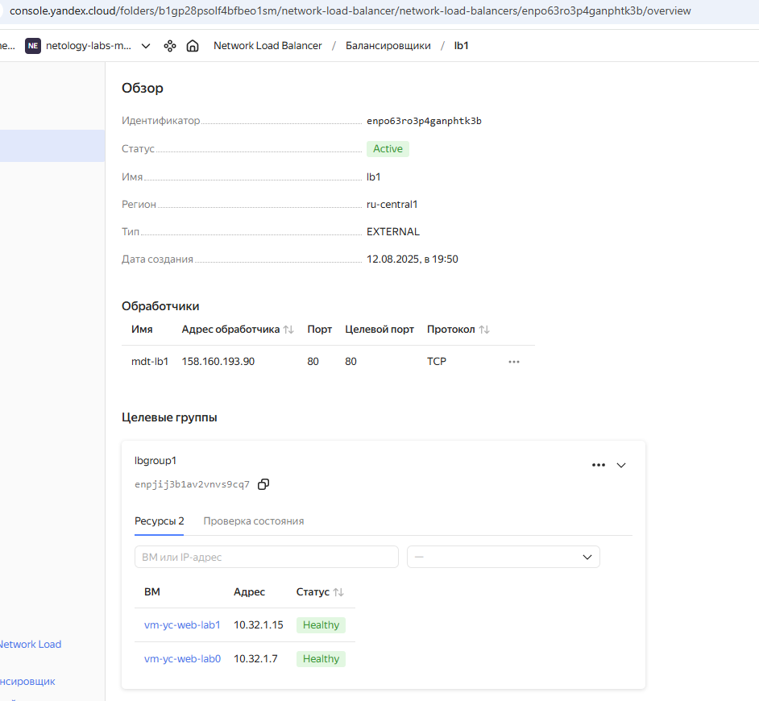
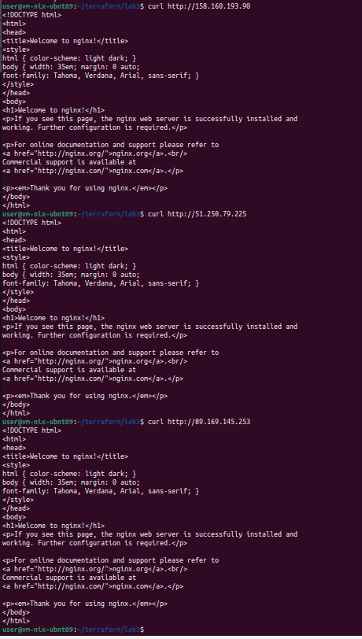
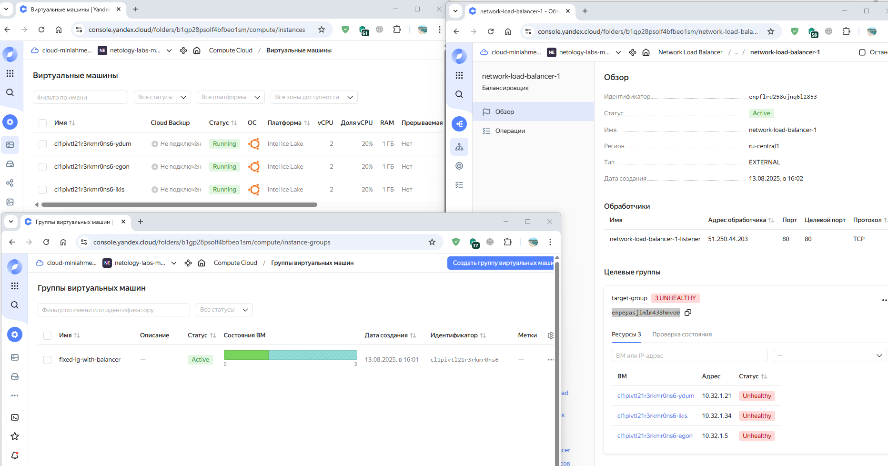

Домашнее задание к занятию «Отказоустойчивость в облаке»

## Задание 1 

*В качестве результата пришлите:*
1. Terraform Playbook.
- Лежат в дериктории /lab1

3. Скриншот статуса балансировщика и целевой группы.

4. Скриншот страницы, которая открылась при запросе IP-адреса балансировщика.

---

## Задание 2*

*В качестве результата пришлите*
1. Terraform Playbook.

- Лежат в дериктории /lab2

2. Скриншот статуса балансировщика и целевой группы.
3. Скриншот страницы, которая открылась при запросе IP-адреса балансировщика.

nginx Не установился и не понятно в чем проблема.

