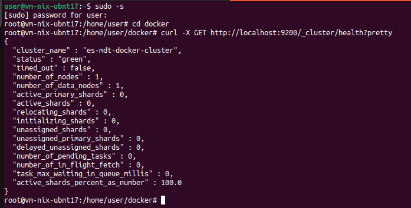
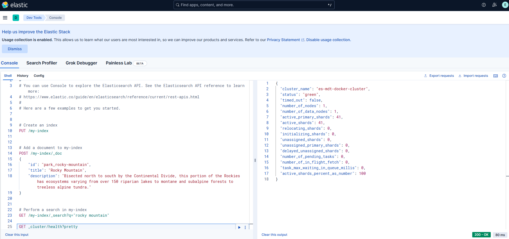
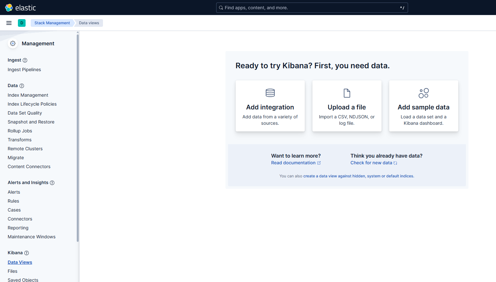
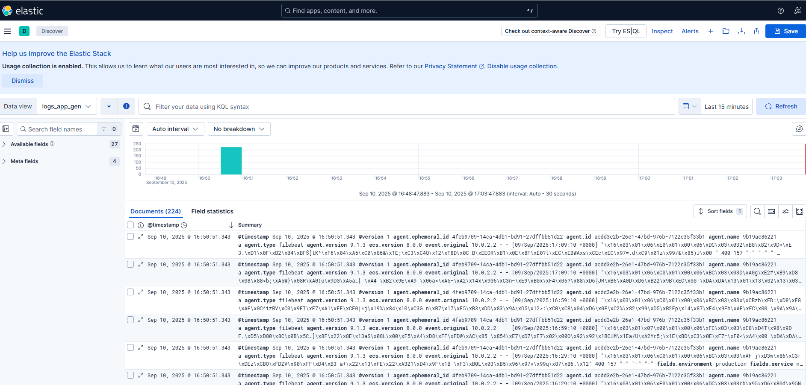

### Задание 1. Elasticsearch 

Установите и запустите Elasticsearch, после чего поменяйте параметр cluster_name на случайный. 

*Приведите скриншот команды 'curl -X GET 'localhost:9200/_cluster/health?pretty', сделанной на сервере с установленным Elasticsearch. Где будет виден нестандартный cluster_name*.

### Решение

---

### Задание 2. Kibana

Установите и запустите Kibana.

*Приведите скриншот интерфейса Kibana на странице http://<ip вашего сервера>:5601/app/dev_tools#/console, где будет выполнен запрос GET /_cluster/health?pretty*.

### Решение

---

### Задание 3. Logstash

Установите и запустите Logstash и Nginx. С помощью Logstash отправьте access-лог Nginx в Elasticsearch. 

*Приведите скриншот интерфейса Kibana, на котором видны логи Nginx.*

### Решение

Пробовал через syslog, пробовал через общий volume и чтение данных - не выходит. 
Контейнеры стартуют, все ОК, явных ошибок не вижу, но чего-то не хватает
Выложил логи контейнеров [server_logs](server_logs) - если получится подсказать куда копать было бы здорово.

```
root@vm-nix-ubnt18:/home/user/docker# tree -L 2
.
├── docker-compose.yml
├── logs
│   ├── access.log
│   └── error.log
├── logstash
│   ├── filebeat.yml
│   ├── logstash.yml
│   ├── nginx.conf
│   └── pipelines.yml
└── nginx
    ├── html
    └── nginx.conf

root@vm-nix-ubnt18:/home/user/docker# docker ps -a
CONTAINER ID   IMAGE                          COMMAND                  CREATED          STATUS          PORTS                                                   NAMES
1de35d2b0e98   kibana:9.1.3                   "/bin/tini -- /usr/l…"   8 minutes ago    Up 8 minutes    0.0.0.0:5601->5601/tcp, [::]:5601->5601/tcp             docker-kibana-1
b110be861833   elastic/filebeat:9.1.3         "/usr/bin/tini -- /u…"   14 minutes ago   Up 14 minutes                                                           docker-filebeat-1
0e04ee796cc2   nginx:stable-alpine3.21-perl   "/docker-entrypoint.…"   14 minutes ago   Up 14 minutes   0.0.0.0:80->80/tcp, [::]:80->80/tcp                     docker-nginx-1
7129cd520555   logstash:9.1.3                 "/usr/local/bin/dock…"   14 minutes ago   Up 14 minutes   0.0.0.0:5044->5044/tcp, [::]:5044->5044/tcp, 9600/tcp   docker-logstash-1
9459b9c4d7e3   elasticsearch:9.1.3            "/bin/tini -- /usr/l…"   29 minutes ago   Up 29 minutes   0.0.0.0:9200->9200/tcp, [::]:9200->9200/tcp, 9300/tcp   elasticsearch



```

---

### Задание 4. Filebeat. 

Установите и запустите Filebeat. Переключите поставку логов Nginx с Logstash на Filebeat. 

*Приведите скриншот интерфейса Kibana, на котором видны логи Nginx, которые были отправлены через Filebeat.*

### Решение



### Задание 5*. Доставка данных 

Настройте поставку лога в Elasticsearch через Logstash и Filebeat любого другого сервиса , но не Nginx. 
Для этого лог должен писаться на файловую систему, Logstash должен корректно его распарсить и разложить на поля. 

*Приведите скриншот интерфейса Kibana, на котором будет виден этот лог и напишите лог какого приложения отправляется.*