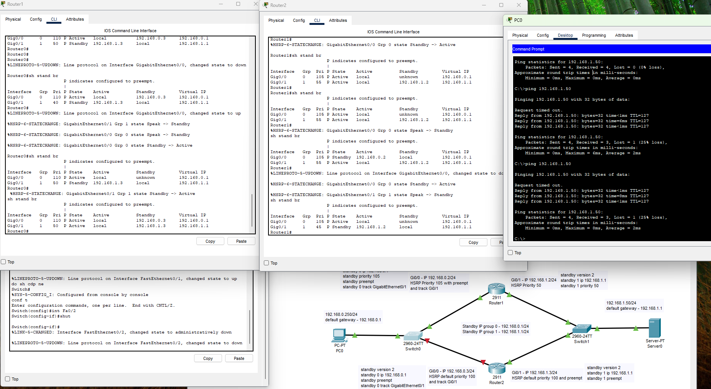

Задание 1

Замечание к лабе: Нужно переименовать в лабе роутеры. В консоли это 0 и 1, а на схеме 1 и 2.





Задание 2
На проверку отправьте получившейся bash-скрипт и конфигурационный файл keepalived, а также скриншот с демонстрацией переезда плавающего ip на другой сервер в случае недоступности порта или файла index.html


[Keepalived.conf](keepalived.conf)
[webcheck.sh](webcheck.sh)

Задание 3*
Изучите дополнительно возможность Keepalived, которая называется vrrp_track_file
Напишите bash-скрипт, который будет менять приоритет внутри файла в зависимости от нагрузки на виртуальную машину (можно разместить данный скрипт в cron и запускать каждую минуту). Рассчитывать приоритет можно, например, на основании Load average.

root@vm-nix-ubnt14:/etc/keepalived# cat keepalived.conf 
```
vrrp_script check_web {
    script "/etc/keepalived/webcheck.sh"
    interval 3
    weight 50
    user user
}

vrrp_instance VI_1 {
    state MASTER
    interface enp0s3
    virtual_router_id 99
    priority 100
    advert_int 1

    virtual_ipaddress {
        10.0.2.199/24
    }

    track_script {
        check_web
    }

    track_file {
        "/etc/keepalived/loadavarage.txt"
    }
}
```

Настроил crontab
```
* * * * * /etc/keepalived/filecheck.sh >> /var/log/filecheck.log 2>&1
```

root@vm-nix-ubnt14:/etc/keepalived# tail -f /var/log/filecheck.log
```
Load Avarage is - 4.24 
Priority is - 50
Load Avarage is - 4.09 
Priority is - 50
Load Avarage is - 3.87 
Priority is - 50
Load Avarage is - 1.48 
Priority is - 50
Load Avarage is - 0.75 
Priority is - 100
Load Avarage is - 0.27 
Priority is - 100
```

```
root@vm-nix-ubnt14:/etc/keepalived# cat filecheck.sh 
#/bin/bash
priority=50
load=$(cat /proc/loadavg | awk '{ print $1 }')
if [[ "$load" > "1" ]]; then
    priority=50
else
    priority=100
fi

echo "$priority" > /etc/keepalived/loadavarage.txt
echo "Load Avarage is - $load "
echo "Priority is - $priority"
```
```
root@vm-nix-ubnt14:/etc/keepalived# systemctl restart keepalived
root@vm-nix-ubnt14:/etc/keepalived# systemctl status keepalived
● keepalived.service - Keepalive Daemon (LVS and VRRP)
     Loaded: loaded (/lib/systemd/system/keepalived.service; enabled; vendor preset: enabled)
     Active: active (running) since Fri 2025-07-25 01:48:34 MSK; 5s ago
   Main PID: 19446 (keepalived)
      Tasks: 2 (limit: 2264)
     Memory: 2.0M
        CPU: 22ms
     CGroup: /system.slice/keepalived.service
             ├─19446 /usr/sbin/keepalived --dont-fork
             └─19447 /usr/sbin/keepalived --dont-fork

июл 25 01:48:34 vm-nix-ubnt14 Keepalived[19446]: Startup complete
июл 25 01:48:34 vm-nix-ubnt14 systemd[1]: keepalived.service: Got notification message from PID 19447, but reception only permitted for main PI>
июл 25 01:48:34 vm-nix-ubnt14 systemd[1]: Started Keepalive Daemon (LVS and VRRP).
июл 25 01:48:34 vm-nix-ubnt14 Keepalived_vrrp[19447]: (VI_1) Entering BACKUP STATE (init)
июл 25 01:48:34 vm-nix-ubnt14 Keepalived_vrrp[19447]: VRRP_Script(check_web) succeeded
июл 25 01:48:34 vm-nix-ubnt14 Keepalived_vrrp[19447]: (VI_1) Changing effective priority from 100 to 150
июл 25 01:48:35 vm-nix-ubnt14 Keepalived_vrrp[19447]: (VI_1) received lower priority (110) advert from 10.0.2.25 - discarding
июл 25 01:48:36 vm-nix-ubnt14 Keepalived_vrrp[19447]: (VI_1) received lower priority (110) advert from 10.0.2.25 - discarding
июл 25 01:48:37 vm-nix-ubnt14 Keepalived_vrrp[19447]: (VI_1) received lower priority (110) advert from 10.0.2.25 - discarding
июл 25 01:48:38 vm-nix-ubnt14 Keepalived_vrrp[19447]: (VI_1) Entering MASTER STATE
```
Логи:
```
Jul 25 01:48:34 vm-nix-ubnt14 Keepalived[19446]: Starting Keepalived v2.2.4 (08/21,2021)
Jul 25 01:48:34 vm-nix-ubnt14 Keepalived[19446]: Running on Linux 6.8.0-64-generic #67~22.04.1-Ubuntu SMP PREEMPT_DYNAMIC Tue Jun 24 15:19:46 UTC 2 (built for Linux 5.15.27)
Jul 25 01:48:34 vm-nix-ubnt14 Keepalived[19446]: Command line: '/usr/sbin/keepalived' '--dont-fork'
Jul 25 01:48:34 vm-nix-ubnt14 Keepalived[19446]: Configuration file /etc/keepalived/keepalived.conf
Jul 25 01:48:34 vm-nix-ubnt14 Keepalived[19446]: NOTICE: setting config option max_auto_priority should result in better keepalived performance
Jul 25 01:48:34 vm-nix-ubnt14 Keepalived[19446]: Starting VRRP child process, pid=19447
Jul 25 01:48:34 vm-nix-ubnt14 Keepalived_vrrp[19447]: (/etc/keepalived/keepalived.conf: Line 24) (VI_1) track file /etc/keepalived/loadavarage.txt not found, ignoring...
Jul 25 01:48:34 vm-nix-ubnt14 Keepalived_vrrp[19447]: SECURITY VIOLATION - scripts are being executed but script_security not enabled.
Jul 25 01:48:34 vm-nix-ubnt14 Keepalived[19446]: Startup complete
Jul 25 01:48:34 vm-nix-ubnt14 systemd[1]: keepalived.service: Got notification message from PID 19447, but reception only permitted for main PID 19446
Jul 25 01:48:34 vm-nix-ubnt14 systemd[1]: Started Keepalive Daemon (LVS and VRRP).
Jul 25 01:48:34 vm-nix-ubnt14 Keepalived_vrrp[19447]: (VI_1) Entering BACKUP STATE (init)
Jul 25 01:48:34 vm-nix-ubnt14 Keepalived_vrrp[19447]: VRRP_Script(check_web) succeeded
Jul 25 01:48:34 vm-nix-ubnt14 Keepalived_vrrp[19447]: (VI_1) Changing effective priority from 100 to 150
Jul 25 01:48:35 vm-nix-ubnt14 Keepalived_vrrp[19447]: (VI_1) received lower priority (110) advert from 10.0.2.25 - discarding
Jul 25 01:48:37 vm-nix-ubnt14 Keepalived_vrrp[19447]: message repeated 2 times: [ (VI_1) received lower priority (110) advert from 10.0.2.25 - discarding]
Jul 25 01:48:38 vm-nix-ubnt14 Keepalived_vrrp[19447]: (VI_1) Entering MASTER STATE
Jul 25 01:48:38 vm-nix-ubnt14 avahi-daemon[583]: Registering new address record for 10.0.2.199 on enp0s3.IPv4.
```


Никак не могу понять почему не видит файл:
```
Jul 25 01:48:34 vm-nix-ubnt14 Keepalived_vrrp[19447]: (/etc/keepalived/keepalived.conf: Line 24) (VI_1) track file /etc/keepalived/loadavarage.txt not found, ignoring...
```
