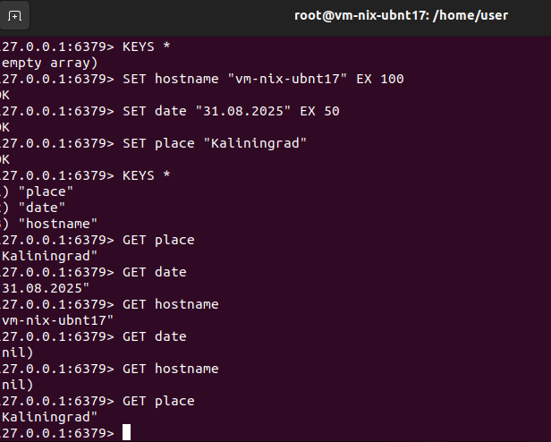

### Задание 1. Кеширование 
Приведите примеры проблем, которые может решить кеширование. 
*Приведите ответ в свободной форме.*

### Решение
Уменьшить отклик при обращении к данным, которые часто нужны, например:
- Данные для чтения из БД
- Картинки и контент с web-сайтов

---

### Задание 2. Memcached
Установите и запустите memcached.
*Приведите скриншот systemctl status memcached, где будет видно, что memcached запущен.*

### Решение
```
root@vm-nix-ubnt17:/home/user# apt-install memcached
```


---

### Задание 3. Удаление по TTL в Memcached
Запишите в memcached несколько ключей с любыми именами и значениями, для которых выставлен TTL 5. 
*Приведите скриншот, на котором видно, что спустя 5 секунд ключи удалились из базы.*

### Решение
```
root@vm-nix-ubnt17:/home/user# telnet localhost 11211
Trying 127.0.0.1...
Connected to localhost.
Escape character is '^]'.

add key1 0 5 5
hello
get key1

add world 0 5 5
world
get world

! На скриншоте с параметрами 0 10 5, т.к. за 5 секунд не всегда успевал написать команду
```


---

### Задание 4. Запись данных в Redis
Запишите в Redis несколько ключей с любыми именами и значениями. 
*Через redis-cli достаньте все записанные ключи и значения из базы, приведите скриншот этой операции.*

### Решение
```
root@vm-nix-ubnt17:/home/user# apt-get install redis
root@vm-nix-ubnt17:/home/user# redis-cli
127.0.0.1:6379> ping
PONG
127.0.0.1:6379> KEYS *
(empty array)
127.0.0.1:6379> SET hostname "vm-nix-ubnt17" EX 100
OK
127.0.0.1:6379> SET date "31.08.2025" EX 50
OK
127.0.0.1:6379> SET place "Kaliningrad"
OK
127.0.0.1:6379> KEYS *
1) "place"
2) "date"
3) "hostname"
127.0.0.1:6379> GET place
"Kaliningrad"
127.0.0.1:6379> GET date
"31.08.2025"
127.0.0.1:6379> GET hostname
"vm-nix-ubnt17"
127.0.0.1:6379> GET date
(nil)
127.0.0.1:6379> GET hostname
(nil)
127.0.0.1:6379> GET place
"Kaliningrad"
127.0.0.1:6379> GET date
(nil)
127.0.0.1:6379> GET hostname
(nil)
127.0.0.1:6379> GET place
"Kaliningrad"
127.0.0.1:6379> KEYS *
1) "place"
```


### Задание 5*. Работа с числами 
Запишите в Redis ключ key5 со значением типа "int" равным числу 5. Увеличьте его на 5, чтобы в итоге в значении лежало число 10.  
*Приведите скриншот, где будут проделаны все операции и будет видно, что значение key5 стало равно 10.*