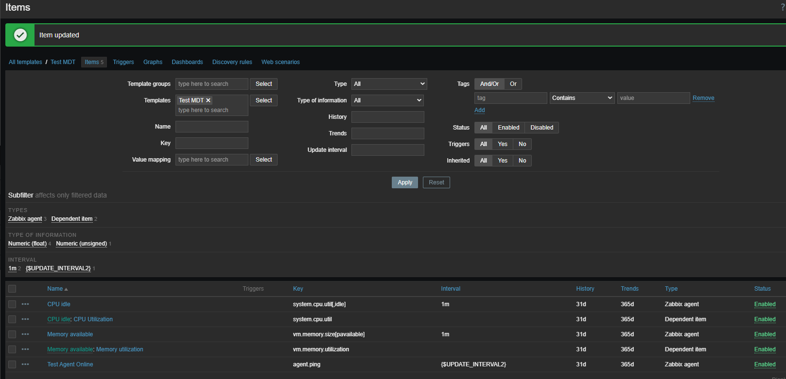
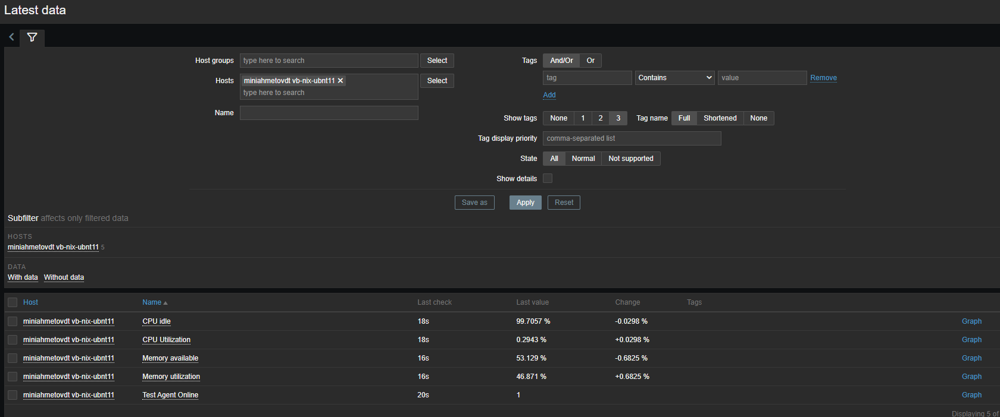
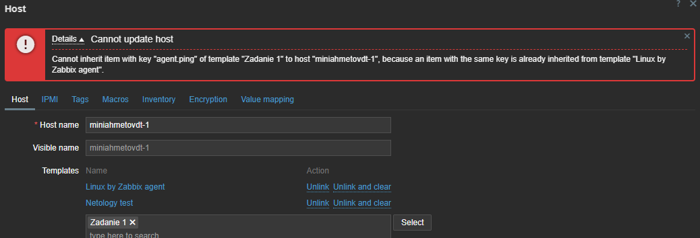
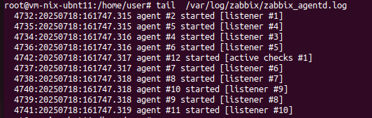
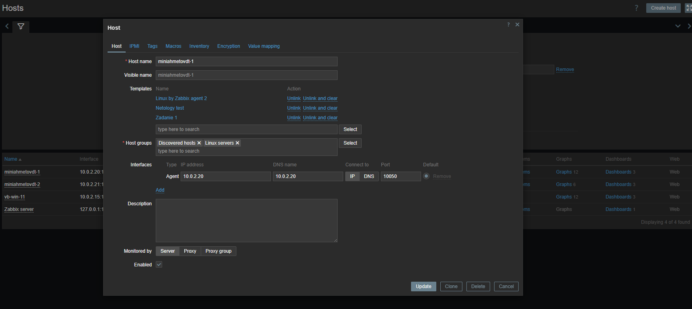
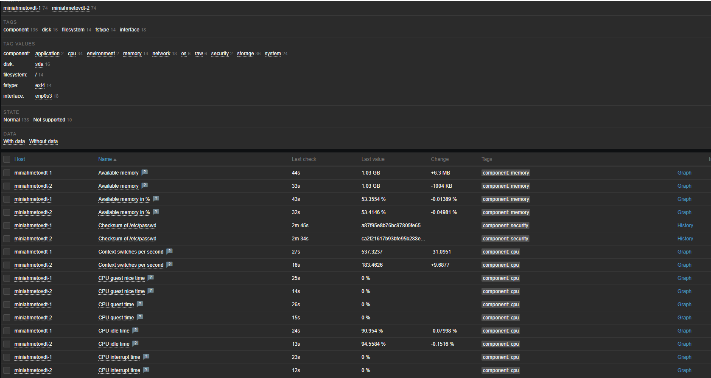
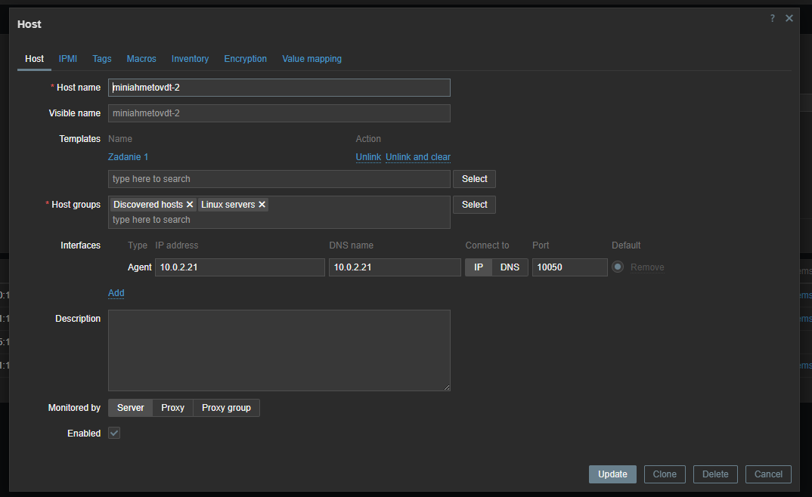

## Дополнительные материалы для выполнения домашних заданий из блока "Введение в DevOps"

- [Дополнительный материал для занятия "8.2. Что такое DevOps. СI/СD"](CICD/8.2-hw.md)

- [Дополнительный материал для занятия "8.3. GitLab"](https://github.com/netology-code/sdvps-materials/tree/main/gitlab)

Домашнее задания "Система мониторинга Zabbix"

Задание 1:
sudo apt install postgresql
wget https://repo.zabbix.com/zabbix/7.0/ubuntu/pool/main/z/zabbix-release/zabbix-release_latest_7.0+ubuntu22.04_all.deb
dpkg -i zabbix-release_latest_7.0+ubuntu22.04_all.deb
apt update
apt install zabbix-server-pgsql zabbix-frontend-php php8.1-pgsql zabbix-apache-conf zabbix-sql-scripts
su - postgres--c 'psql --command "CREATE USER zabbix WITH PASSWORD '\'ABC\' ';"'
su - postgres--c 'psql --command "CREATE DATABASE zabbix OWNER zabbix';"'
zcat /usr/share/zabbix-sql-scripts/postgresql/server.sql.gz | sudo -u zabbix psql zabbix
sed -i 's/# DBPassword=/DBPassword=DEF/g' /etc/zabbix/zabbix_server.conf
systemctl restart zabbix-server zabbix-agent apache2
systemctl enable zabbix-server zabbix-agent apache2

Задание 2:
wget https://repo.zabbix.com/zabbix/7.0/ubuntu/pool/main/z/zabbix-release/zabbix-release_latest_7.0+ubuntu22.04_all.deb
dpkg -i zabbix-release_latest_7.0+ubuntu22.04_all.deb
apt update
apt install zabbix-agent
systemctl restart zabbix-agent
systemctl enable zabbix-agent
sed -i 's/Server=127.0.0.1/Server=10.0.2.20/g' /home/user# nano /etc/zabbix/zabbix_agentd.conf

