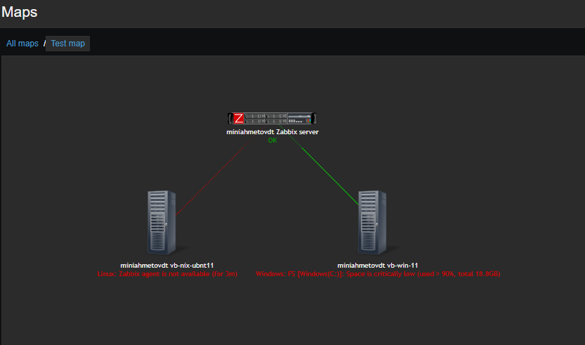

## Дополнительные материалы для выполнения домашних заданий из блока "Введение в DevOps"

- [Дополнительный материал для занятия "8.2. Что такое DevOps. СI/СD"](CICD/8.2-hw.md)

- [Дополнительный материал для занятия "8.3. GitLab"](https://github.com/netology-code/sdvps-materials/tree/main/gitlab)

Домашнее задания "Система мониторинга Zabbix"

Задание 1
Создайте свой шаблон, в котором будут элементы данных, мониторящие загрузку CPU и RAM хоста.

Задание 2
Добавьте в Zabbix два хоста и задайте им имена <фамилия и инициалы-1> и <фамилия и инициалы-2>. Например: ivanovii-1 и ivanovii-2.

Задание 3
Привяжите созданный шаблон к двум хостам. Также привяжите к обоим хостам шаблон Linux by Zabbix Agent.

Задание 4
Создайте свой кастомный дашборд.

Задание 5* со звёздочкой
Создайте карту и расположите на ней два своих хоста.

Задание 6* со звёздочкой
Создайте UserParameter на bash и прикрепите его к созданному вами ранее шаблону. Он должен вызывать скрипт, который:

Задание 7* со звёздочкой
Доработайте Python-скрипт из лекции, создайте для него UserParameter и прикрепите его к созданному вами ранее шаблону. 

Задание 8* со звёздочкой
Настройте автообнаружение и прикрепление к хостам созданного вами ранее шаблона.

